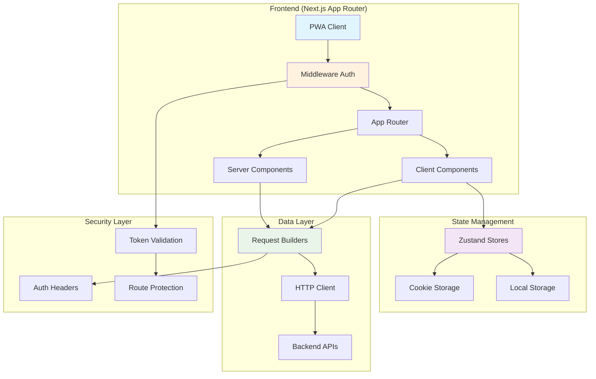
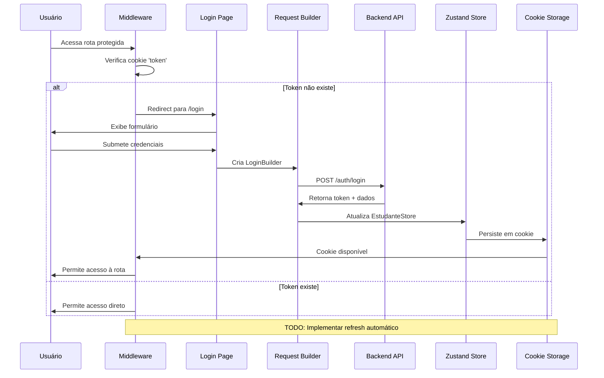
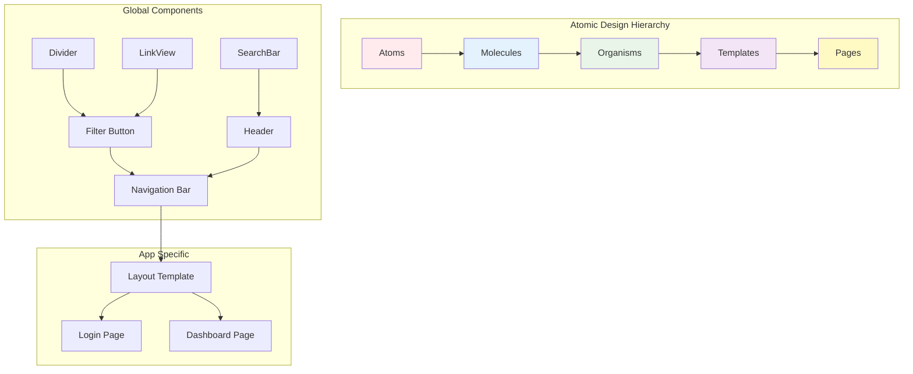
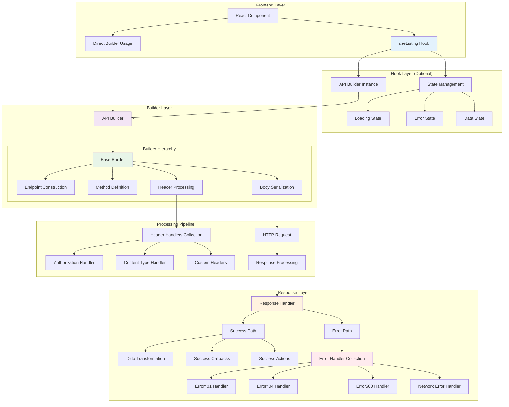
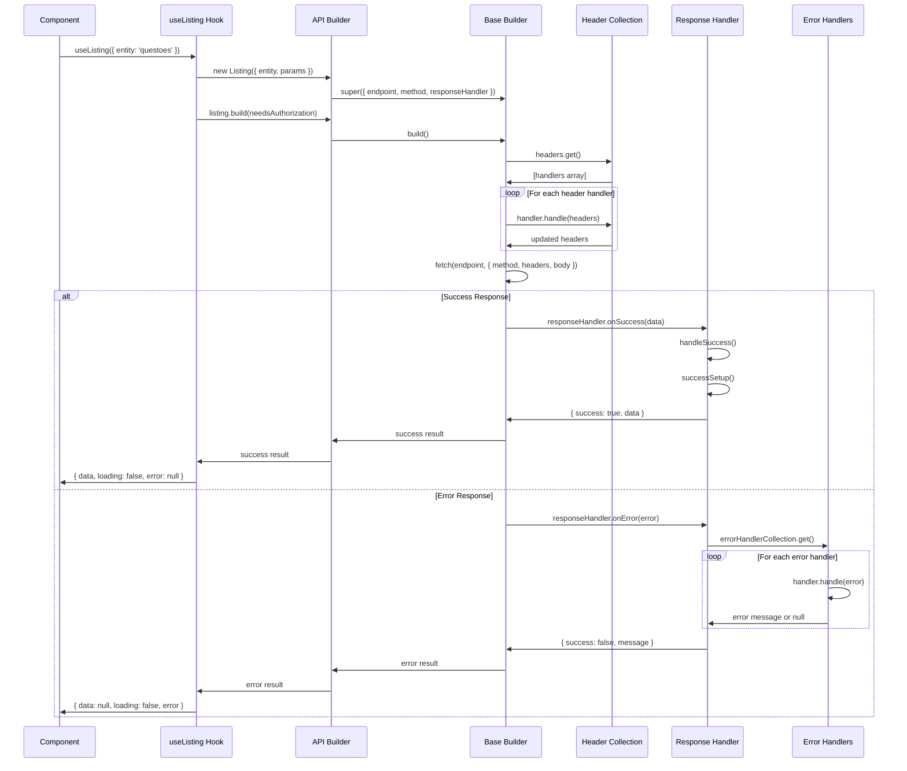
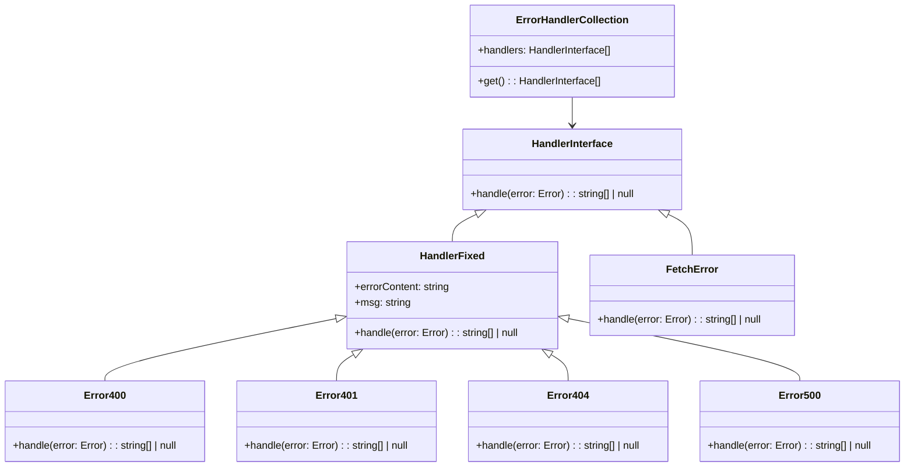
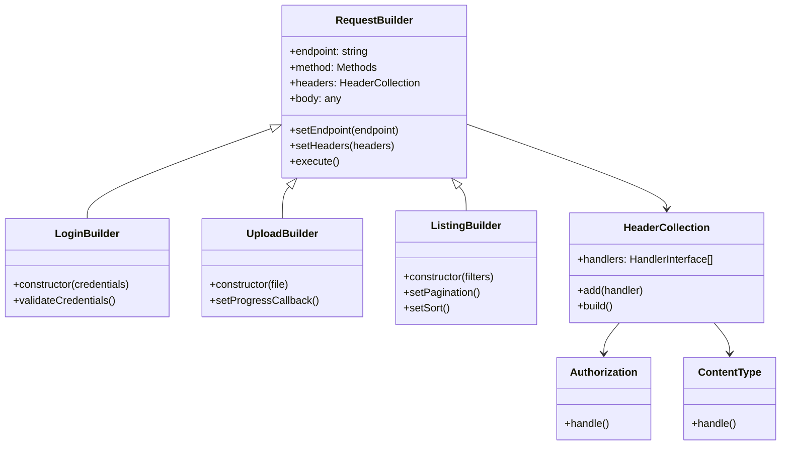
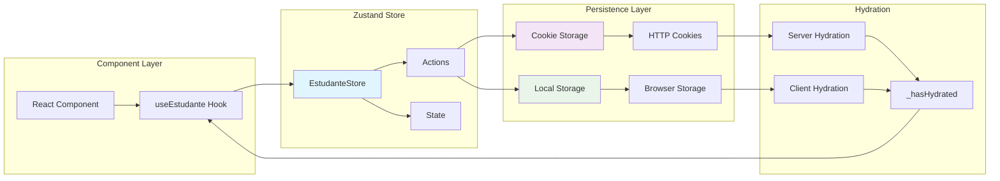

# Relatório Técnico - Arquitetura do Sistema MedRQE

## Índice
1. [Estrutura de Diretórios e Arquivos](#1-estrutura-de-diretórios-e-arquivos)
2. [Roteamento e Navegação](#2-roteamento-e-navegação)
3. [Componentização](#3-componentização)
4. [Gestão de Estado](#4-gestão-de-estado)
5. [Consumo de Dados e Comunicação Backend](#5-consumo-de-dados-e-comunicação-backend)
6. [Controle de Acesso e Autenticação](#6-controle-de-acesso-e-autenticação)
7. [Estratégias de Renderização](#7-estratégias-de-renderização)
8. [Performance, Otimização e SEO](#8-performance-otimização-e-seo)
9. [Segurança](#9-segurança)
10. [Considerações de Escalabilidade e Manutenção](#10-considerações-de-escalabilidade-e-manutenção)
11. [Diagrama e Representações Visuais](#11-diagrama-e-representações-visuais)
12. [Recomendações e Próximos Passos](#recomendações-e-próximos-passos)

---

## 1. Estrutura de Diretórios e Arquivos

### 1.1 Organização Geral
O projeto segue uma arquitetura híbrida que combina a estrutura do Next.js App Router com uma organização modular personalizada:

```
pwa-app/
├── src/                    # Código fonte principal da aplicação
│   ├── app/               # App Router do Next.js 15.3.1
│   │   ├── layout.tsx     # Layout raiz com configuração de tema
│   │   ├── manifest.ts    # Configuração PWA
│   │   └── (routes)/      # Rotas agrupadas
│   ├── component/         # Componentes específicos da aplicação
│   ├── store/            # Gerenciamento de estado (Zustand)
│   └── middleware.ts     # Middleware de autenticação
├── global/               # Módulos globais reutilizáveis
│   ├── component/        # Componentes atômicos e compostos
│   ├── request/          # Sistema de requisições HTTP
│   ├── form/            # Sistema de formulários
│   ├── filter/          # Sistema de filtros
│   └── pwa/             # Funcionalidades PWA
└── public/              # Arquivos estáticos
```

### 1.2 Arquivos Fundamentais do App Router

#### `layout.tsx` - Layout raiz que implementa:
- Configuração de fontes personalizadas (Comfortaa, SF Pro Display/Text, Inter)
- Sistema de temas (dark/light) baseado em cookies
- Splash Screen condicional
- Portais para componentes modais (`#drawer-root`, `#dialog-root`)

```tsx
export default async function RootLayout({
  children,
}: Readonly<{
  children: React.ReactNode;
}>) {
  const cookieStore = await cookies();
  const splashShown = cookieStore.get("splash_shown")?.value;
  const theme = cookieStore.get("theme")?.value || "light";

  return (
    <html
      lang="pt-BR"
      className={`${comfortaa.variable} ${sfProDisplay.variable} ${sfProText.variable} ${inter.variable} ${theme === "dark" ? "dark-theme" : ""}`}
    >
      <body className="screen">
        <AppHeightWrapper />
        <SessionTracker/>
        {!splashShown ? <SplashScreen /> : children}
        <div id="drawer-root"></div>
        <div id="dialog-root"></div>
      </body>
    </html>
  );
}
```

#### `middleware.ts` - Middleware de segurança que:
- Protege rotas privadas verificando token de autenticação
- Redireciona usuários não autenticados para `/login`
- Implementa lista de rotas públicas (`/login`, `/recuperacao-senha`, `/geracao-nova-senha`)

```typescript
export default function middleware(request: NextRequest) {
  const { pathname } = request.nextUrl;
  const isLogged = request.cookies.has("token");
  const isPublicRoute = publicRoutes.includes(pathname);
 
  // se não estiver logado e não for uma rota pública, redireciona para a página de login
  if (!isLogged && !isPublicRoute) {
    return NextResponse.redirect(new URL("/login", request.url));
  }

  // se estiver logado e for uma rota pública, redireciona para a página inicial
  if (isLogged && isPublicRoute) {
    return NextResponse.redirect(new URL("/", request.url));
  }

  return NextResponse.next();
}
```

---

## 2. Roteamento e Navegação

### 2.1 App Router com Agrupamento de Rotas
O sistema utiliza o **Next.js App Router** com a estratégia de agrupamento através de `(routes)`:

```
src/app/(routes)/
├── login/           # Autenticação
├── questoes/        # Sistema de questões
├── flashcards/      # Estudos com flashcards
├── simulados/       # Simulados e provas
├── estatisticas/    # Dashboard de estatísticas
├── perfil/          # Perfil do usuário
├── como-estudar/    # Guias de estudo
├── conquistas/      # Sistema de gamificação
├── faturas/         # Gestão financeira
├── hot-topics/      # Tópicos em destaque
├── mapas-mentais/   # Mapas mentais
├── pwa/            # Configurações PWA
├── salvos/         # Conteúdo salvo
├── sair/           # Logout
└── teste/          # Ambiente de testes
```

### 2.2 Estratégias de Roteamento Implementadas

#### **Rotas Protegidas**
O middleware intercepta todas as navegações, verificando autenticação via cookie `token`:

```typescript
export const publicRoutes = ["/login", "/recuperacao-senha", "/geracao-nova-senha"];
```

#### **Layout Compartilhado**
O `layout.tsx` raiz fornece estrutura comum para toda a aplicação:
- Configuração de tema global
- Gerenciamento de splash screen
- Providers globais (AppHeightWrapper, SessionTracker)

#### **Navegação Condicional**
Sistema implementa redirecionamento baseado em estado de autenticação:
- Usuário não logado em rota privada → `/login`
- Usuário logado em rota pública → `/`

---

## 3. Componentização

### 3.1 Arquitetura de Componentes
O sistema adota uma arquitetura de componentes hierárquica baseada em **Atomic Design**:

```
global/component/
├── atomic/          # Átomos (componentes básicos)
│   ├── Divider.tsx     # Divisores visuais
│   ├── LinkView.tsx    # Links customizados
│   ├── SearchBar.tsx   # Barra de busca
│   └── UploadImage.tsx # Upload de imagens
├── button/          # Moléculas de botões
│   ├── Filter.tsx      # Botões de filtro
│   ├── RangeSelector.tsx # Seletores de intervalo
│   ├── Shadow.tsx      # Botões com sombra
│   └── Switch.tsx      # Switches toggle
├── chart/          # Componentes de visualização
│   └── Pie.tsx        # Gráficos de pizza
├── form/           # Organismos de formulário
├── overlay/        # Templates de overlay
└── viewing/        # Componentes de visualização
```

### 3.2 Server vs Client Components

#### **Server Components** (Padrão)
- Layouts e páginas principais
- Componentes que buscam dados no servidor
- Renderização otimizada para SEO

#### **Client Components** (Explícitos com `"use client"`)
- Componentes PWA (`InstallPrompt.tsx`)
- Componentes interativos com estado
- Hooks personalizados (`useEstudar.ts`, `useToggle.ts`)

**Exemplo de Client Component**:
```typescript
"use client";
import { useState, useEffect } from "react";

export function InstallPrompt() {
  const [isIOS, setIsIOS] = useState(false);
  const [isStandalone, setIsStandalone] = useState(false);

  useEffect(() => {
    setIsIOS(/iPad|iPhone|iPod/.test(navigator.userAgent) && !(window as any).MSStream);
    setIsStandalone(window.matchMedia("(display-mode: standalone)").matches);
  }, []);

  if (isStandalone) {
    return null; // Don't show install button if already installed
  }

  return (
    <div>
      <h3>Install App</h3>
      <button>Add to Home Screen</button>
      {/* ... */}
    </div>
  );
}
```

### 3.3 Padrões de Reutilização

#### **Separação de Responsabilidades**
- `global/component/`: Componentes reutilizáveis entre projetos
- `src/component/`: Componentes específicos da aplicação MedRQE

---

## 4. Gestão de Estado

### 4.1 Zustand como Solução Principal
O sistema utiliza **Zustand** para gerenciamento de estado global com persistência:

```typescript
// EstudanteStore.ts
type EstudanteStore = {
  estudante: Estudante;
  setEstudante: (estudante: Estudante, expiresInDays?: number) => void;
  clearEstudante: () => void;
  updateUrlImagem: (urlImagem: string) => void;
  _hasHydrated: boolean;
  setHasHydrated: (state: any) => void;
  updateExpiration: (expiresInDays: number) => void;
};

export const useEstudante = create<EstudanteStore>()(
  persist(
    (set, get) => ({
      estudante: {
        urlImagem: "",
        nomeCompleto: "",
        periodosPlanosId: ""
      },
      setEstudante: (estudante, expiresInDays = 30) => {
        // Lógica de persistência com expiração configurável
        cookieStorage = createCookieStorage(expiresInDays);
        set({ estudante });
      },
      clearEstudante: () => set({ estudante: {} }),
      // ... outras ações
    }),
    {
      name: "estudante-storage",
      storage: createJSONStorage(() => cookieStorage)
    }
  )
);
```

### 4.2 Estratégias de Persistência

#### **Cookie Storage**
```typescript
// cookieStorage.ts
export const createCookieStorage = (expiresInDays: number): StateStorage => ({
  getItem: (name: string): string | null => {
    return Cookie.get(name) || null;
  },
  setItem: (name: string, value: string): void => {
    Cookie.set(name, value, expiresInDays);
  },
  removeItem: (name: string): void => {
    Cookie.remove(name);
  }
});
```

#### **Stores Especializados**
- **EstudanteStore**: Dados do usuário e perfil
- **FlashcardStore**: Estado dos flashcards de estudo
- **QuestaoStore**: Controle de questões e respostas
- **localStorageStore**: Cache temporário e preferências

### 4.3 Hooks Personalizados

```typescript
// useToggle.ts - Gerenciamento de estado booleano
export const useToggle = (initialValue: boolean = false) => {
  const [value, setValue] = useState(initialValue);
  const toggle = useCallback(() => setValue(v => !v), []);
  const setTrue = useCallback(() => setValue(true), []);
  const setFalse = useCallback(() => setValue(false), []);
  
  return { value, toggle, setTrue, setFalse };
};

// useSearch.ts - Estado de busca e filtros
// useEnv.ts - Containerização de componentes
```

---

## 5. Consumo de Dados e Comunicação Backend

### 5.1 Visão Geral do Sistema de Request Builder

O projeto implementa um sistema arquitetural robusto e escalável para comunicação HTTP baseado no **padrão Builder** combinado com **Strategy Pattern** para tratamento de responses e erros. Este sistema fornece uma abstração completa que separa a configuração da requisição, o processamento da resposta e o tratamento de erros.

#### **Arquitetura do Sistema**
```
global/request/
├── builder/           # Request Builders (raiz)
│   ├── Builder.ts     # Classe base abstrata
│   ├── Listing.ts     # Builder para listagens
│   ├── Insert.ts      # Builder para inserções
│   └── api/          # Builders especializados para API
├── response/handler/  # Response Handlers
├── error/handler/     # Error Handlers
├── header/handler/    # Header Handlers
└── helper/           # Utilities (ParamBuilder, etc)
```

### 5.2 Camadas de Abstração e Fluxo de Execução

#### **1. Camada de Hook (Opcional)**
O sistema oferece hooks React que encapsulam a lógica de estado e ciclo de vida:

```typescript
// useListing.ts - Hook para listagens com estado gerenciado
export function useListing<T = any>({
  entity,
  id,
  parentEntity,
  parentId,
  headers,
  params,
  needsAuthorization = false,
}: UseListingProps): UseListingReturn<T> {
  const [data, setData] = useState<Listagem<T>>({
    currentPage: 1,
    resultsPerPage: 5,
    totalRows: 0,
    rows: [],
  });
  const [loading, setLoading] = useState(true);
  const [error, setError] = useState<string | null>(null);

  useEffect(() => {
    const fetchData = async () => {
      setLoading(true);
      
      try {
        // Instancia o Request Builder especializado
        const listing = new Listing({
          entity: entity,
          id: id || "",
          parentEntity: parentEntity || "",
          parentId: parentId || 0,
          headers: headers || null,
          params: params || {},
        });
        
        // Executa a requisição com tratamento automático
        const result = await listing.build(needsAuthorization);

        if (!result.success) {
          setError(result.message[0]);
        }

        setData(result.data || defaultListingData);
      } finally {
        setLoading(false);
      }
    };

    fetchData();
  }, []);

  return { data, setData, loading, error };
}
```

**Vantagens dos Hooks:**
- **Gerenciamento de Estado Automático**: Loading, error e data states
- **Reatividade**: Re-execução automática baseada em dependências
- **Simplicidade**: Interface declarativa para componentes React
- **Reutilização**: Lógica comum extraída e reutilizável
- **Type Safety**: Generics para tipagem específica do retorno

#### **2. Camada de Request Builder Especializado**

##### **Builder da Raiz vs Builder da API**

**Builders da Raiz** (`global/request/builder/`):
```typescript
// Listing.ts (raiz) - Builder base com lógica core
export class Listing extends RequestBuilder {
  constructor({
    entity,
    id = null,
    parentEntity = null,
    parentId = null,
    params = {},
    headers = null,
    responseHandler = null,
  }: ListingProps) {
    const apiUrl = process.env.NEXT_PUBLIC_API_URL;

    // Construção dinâmica do endpoint
    const endpoint = parentEntity
      ? `${apiUrl}/${parentEntity}/${parentId}/${entity}${id ? `/${id}` : ""}`
      : `${apiUrl}/${entity}${id ? `/${id}` : ""}`;

    const method: Methods = "GET";

    // Define Response Handler padrão se não fornecido
    responseHandler = responseHandler || new ResponseHandler({});

    super({ endpoint, method, headers, body: null, responseHandler });

    // Adiciona parâmetros de query string
    const paramBuilder = new ParamBuilder();
    const query = paramBuilder.build(params);
    if (query) {
      this.endpoint += `?${query}`;
    }
  }
}
```

**Builders da API** (`global/request/builder/api/`):
```typescript
// api/Listing.ts - Wrapper especializado para API
export class Listing extends ListingRequestBuilder {
  constructor({
    entity,
    id = null,
    parentEntity = null,
    parentId = null,
    params = {},
    headers = null,
    responseHandler = null,
  }: ListingProps) {
    // Define automaticamente o Response Handler específico da API
    responseHandler = responseHandler || new ResponseHandler({});

    // Herda toda lógica do builder base
    super({ entity, id, parentEntity, parentId, params, headers, responseHandler });
  }
}
```

**Diferenças Estratégicas:**
- **Raiz**: Lógica fundamental e configuração base
- **API**: Especializações e defaults específicos para diferentes contextos
- **Flexibilidade**: Permite diferentes comportamentos para diferentes APIs
- **Manutenibilidade**: Separação clara de responsabilidades

#### **3. Camada de Request Builder Base**

```typescript
export class RequestBuilder {
  protected endpoint: string;
  protected method: Methods;
  protected headers: HeaderHandlerCollection;
  protected body: any;
  protected responseHandler: ResponseHandlerInterface;

  constructor({ endpoint, method = "GET", headers, body = {}, responseHandler }: BuilderProps) {
    this.endpoint = endpoint;
    this.method = method;
    this.headers = headers || new DefaultHeaderCollection();
    this.body = body;
    this.responseHandler = responseHandler;
  }

  /**
   * Executa a requisição HTTP com toda a pipeline de processamento
   */
  async build(needsAuthorization?: boolean): Promise<any> {
    try {
      let finalHeaders: HeadersInit = {};
      
      // 1. Aplica todos os Header Handlers da coleção
      const handlers = this.headers.get();
      for (const handler of handlers) {
        finalHeaders = handler.handle(finalHeaders);
      }
      
      // 2. Aplica Authorization se necessário
      if (needsAuthorization) {
        const authorization = new Authorization();
        finalHeaders = authorization.handle(finalHeaders);
      }

      // 3. Determina Content-Type para serialização do body
      const contentType = this.extractContentType(finalHeaders);

      // 4. Executa requisição HTTP
      const response = await fetch(this.endpoint, {
        method: this.method,
        headers: finalHeaders,
        body: this.body
          ? contentType === "application/json"
            ? JSON.stringify(this.body)
            : this.body
          : null,
      });

      // 5. Processa resposta
      let data;
      try {
        data = await response.json();
      } catch {
        data = [];
      }

      // 6. Verifica erros HTTP ou de aplicação
      if (!response.ok || (data && data.success === false)) {
        throw new Error(`HTTP error ${response.status}`, { cause: data });
      }

      // 7. Delega para Response Handler em caso de sucesso
      return this.responseHandler.onSuccess(data);
    } catch (error) {
      // 8. Delega para Response Handler em caso de erro
      return this.responseHandler.onError(error as Error);
    }
  }
}
```

### 5.3 Sistema de Response Handlers

#### **Hierarquia e Responsabilidades**
```typescript
// Handler.ts - Base class para todos os response handlers
export class ResponseHandler implements ResponseHandlerInterface {
  protected onSuccessFn: (result: any) => any;
  protected onErrorFn: (error: Error) => any;
  protected errorHandlerCollection?: ErrorHandlerCollection;
  protected onSuccessCallback?: (result: any) => Promise<void> | void;
  protected onSuccessActions?: ActionInterface[];

  constructor({ 
    onSuccessFn, 
    onErrorFn, 
    errorHandlerCollection, 
    onSuccessCallback, 
    onSuccessActions 
  }: ResponseHandlerProps) {
    this.onSuccessFn = onSuccessFn ?? (() => {});
    this.onErrorFn = onErrorFn ?? (() => {});
    this.errorHandlerCollection = errorHandlerCollection;
    this.onSuccessCallback = onSuccessCallback;
    this.onSuccessActions = onSuccessActions;
  }

  onSuccess(result: any): any {
    return this.onSuccessFn(result);
  }

  onError(error: Error): any {
    return this.onErrorFn(error);
  }

  protected handleError(error: Error): any {
    let errorResponse = {};
    
    // Processa através da coleção de Error Handlers
    this.errorHandlerCollection?.get().forEach((errorHandler: HandlerInterface) => {
      let errorMessage = errorHandler.handle(error);
      if (errorMessage) {
        errorResponse = {
          success: false,
          messageType: "error",
          message: errorMessage,
        };
      }
    });

    return errorResponse;
  }

  protected async successSetup<T>(result: T) {
    // Executa callbacks de sucesso
    if (this.onSuccessCallback) {
      await this.onSuccessCallback(result);
    }
    
    // Executa actions de sucesso
    if (this.onSuccessActions) {
      this.onSuccessActions.forEach((action: ActionInterface) => {
        action.handleSuccess(result);
      });
    }
  }
}
```

#### **Response Handler Especializado**
```typescript
// Listing.ts - Handler específico para listagens
export class Listing<T = any> extends ResponseHandler {
  constructor({
    errorHandlerCollection = null,
    onSuccessCallback,
    onSuccessActions,
  }: ListingProps<T>) {
    super({
      errorHandlerCollection: errorHandlerCollection || new DefaultErrorHandlerCollection(),
      onSuccessCallback,
      onSuccessActions,
    });
    
    // Define handlers específicos para this context
    this.onSuccessFn = this.handleSuccess.bind(this);
    this.onErrorFn = this.handleError.bind(this);
  }

  protected async handleSuccess<T = any>(result: Listagem<T>): Promise<any> {
    // Executa setup de sucesso (callbacks e actions)
    this.successSetup(result);

    // Retorna formato padronizado para listagens
    return {
      success: true,
      data: result,
    };
  }
}
```

### 5.4 Sistema de Error Handlers

#### **Coleções de Error Handlers**
```typescript
// Default.ts - Coleção padrão de tratamento de erros
export class Default extends Collection {
  constructor() {
    super({
      elements: [
        new Error400(),    // Bad Request
        new Error401(),    // Unauthorized  
        new Error403(),    // Forbidden
        new Error404(),    // Not Found
        new Error422(),    // Unprocessable Entity
        new Error500(),    // Internal Server Error
        new Fetch()        // Network/Fetch errors
      ]
    });
  }
}
```

#### **Error Handlers Específicos**
```typescript
// Error401.ts - Handler para erros de autorização
export class Error401 extends HandlerFixed {
  constructor() {
    super({ 
      errorContent: "HTTP error 401", 
      msg: "Não autorizado - verifique as credenciais" 
    });
  }
}

// HandlerFixed.ts - Base para handlers com mensagem fixa
export class HandlerFixed implements HandlerInterface {
  protected errorContent: string;
  protected msg: string;

  constructor({ errorContent, msg }: { errorContent: string; msg: string }) {
    this.errorContent = errorContent;
    this.msg = msg;
  }

  handle(error: Error): string[] | null {
    if (error.message.includes(this.errorContent)) {
      return [this.msg];
    }
    return null;
  }
}
```

### 5.5 Sistema de Header Handlers

#### **Collection Pattern para Headers**
```typescript
// Collection.ts
export class Collection implements CollectionInterface {
  private handlers: HandlerInterface[] = [];

  add(handler: HandlerInterface): this {
    this.handlers.push(handler);
    return this;
  }

  get(): HandlerInterface[] {
    return this.handlers;
  }

  build(): { [key: string]: string } {
    return this.handlers.reduce((headers, handler) => ({
      ...headers,
      ...handler.handle()
    }), {});
  }
}
```

#### **Header Handlers Específicos**
```typescript
// Authorization.ts
export default class Authorization implements HandlerInterface {
  handle(currentHeaders: HeadersInit): HeadersInit {
    const token = Cookie.get('token');
    if (token) {
      return {
        ...currentHeaders,
        'Authorization': `Bearer ${token}`
      };
    }
    return currentHeaders;
  }
}

// ContentType.ts
export default class ContentType implements HandlerInterface {
  constructor(private type: string = 'application/json') {}
  
  handle(currentHeaders: HeadersInit): HeadersInit {
    return {
      ...currentHeaders,
      'Content-Type': this.type
    };
  }
}
```

### 5.6 Helpers e Utilities

#### **ParamBuilder - Construção de Query Strings**
```typescript
export default class ParamBuilder {
  public build(params: Record<string, any>): string {
    const esc = encodeURIComponent;
    return Object.entries(params)
      .map(([k, v]) => `${esc(k)}=${esc(v)}`)
      .join("&");
  }
}
```

### 5.7 Uso Prático: Direto vs Hook

#### **Uso Direto (Flexibilidade Máxima)**
```typescript
// Para casos que requerem controle total
const fetchCustomData = async () => {
  const listing = new Listing({
    entity: 'questoes',
    params: { page: 1, limit: 10 },
    headers: customHeaderCollection,
    responseHandler: customResponseHandler
  });
  
  const result = await listing.build(true); // needsAuthorization = true
  return result;
};
```

#### **Uso via Hook (Simplicidade)**
```typescript
// Para componentes React com necessidades padrão
function QuestoesList() {
  const { data, loading, error } = useListing({
    entity: 'questoes',
    params: { page: 1, limit: 10 },
    needsAuthorization: true
  });

  if (loading) return <Loading />;
  if (error) return <Error message={error} />;
  
  return <List items={data.rows} />;
}
```

### 5.8 Vantagens Arquiteturais

1. **Separação de Responsabilidades**: Cada camada tem uma responsabilidade específica
2. **Extensibilidade**: Novos builders, handlers e helpers podem ser adicionados facilmente
3. **Testabilidade**: Cada componente pode ser testado isoladamente
4. **Reutilização**: Lógica comum extraída em classes base
5. **Type Safety**: TypeScript forte em toda a pipeline
6. **Flexibilidade**: Múltiplas formas de uso (direto ou via hooks)
7. **Manutenibilidade**: Código organizado e bem estruturado
8. **Error Handling**: Sistema robusto e configurável de tratamento de erros

---

## 6. Controle de Acesso e Autenticação

### 6.1 Middleware de Segurança

O sistema implementa um middleware robusto que intercepta todas as requisições:

```typescript
export const publicRoutes = ["/login", "/recuperacao-senha", "/geracao-nova-senha"];

export default function middleware(request: NextRequest) {
  const { pathname } = request.nextUrl;
  const isLogged = request.cookies.has("token");
  const isPublicRoute = publicRoutes.includes(pathname);
 
  // Proteção de rotas privadas
  if (!isLogged && !isPublicRoute) {
    return NextResponse.redirect(new URL("/login", request.url));
  }

  // Redirecionamento de usuários autenticados em rotas públicas
  if (isLogged && isPublicRoute) {
    return NextResponse.redirect(new URL("/", request.url));
  }

  // TODO: Implementar refresh do token
  // dar o refresh no token (definir uma hora de expiração)

  return NextResponse.next();
}

export const config = {
  matcher: ['/((?!api|_next/static|_next/image|favicon.ico).*)']
};
```

### 6.2 Sistema de Autenticação

#### **Fluxo de Login**
```typescript
// Login.ts (Builder pattern)
export class LoginBuilder extends RequestBuilder {
  constructor(credentials: LoginCredentials) {
    super({
      endpoint: '/api/auth/login',
      method: 'POST',
      body: credentials,
      responseHandler: new LoginResponseHandler()
    });
  }
}
```

#### **Recuperação de Senha**
```typescript
// RecuperacaoSenha.ts
export class RecuperacaoSenhaBuilder extends RequestBuilder {
  constructor(email: string) {
    super({
      endpoint: '/api/auth/recover',
      method: 'POST',
      body: { email },
      responseHandler: new RecoverResponseHandler()
    });
  }
}
```

### 6.3 Persistência de Sessão

#### **Token Management**
- **Storage**: Cookies HTTP-only para segurança
- **Expiração**: Configurável via store (padrão 30 dias)
- **Renovação**: TODO - implementar refresh automático

#### **Session Tracking**
```tsx
// SessionTracker component
export default function SessionTracker() {
  useEffect(() => {
    // Lógica de rastreamento de sessão
    // Monitoramento de atividade do usuário
    // Renovação automática de tokens
  }, []);
}
```

---

## 7. Estratégias de Renderização

### 7.1 Server-Side Rendering (SSR)

#### **Layout Principal**
O layout raiz utiliza SSR para renderização server-side com dados de cookies:

```tsx
export default async function RootLayout({ children }: {
  children: React.ReactNode;
}) {
  // Server-side data fetching
  const cookieStore = await cookies();
  const splashShown = cookieStore.get("splash_shown")?.value;
  const theme = cookieStore.get("theme")?.value || "light";

  return (
    <html lang="pt-BR" className={`${theme === "dark" ? "dark-theme" : ""}`}>
      <body>
        {/* Renderização condicional no servidor */}
        {!splashShown ? <SplashScreen /> : children}
      </body>
    </html>
  );
}
```

#### **Páginas de Autenticação**
- SSR para SEO e performance inicial
- Hidratação rápida de componentes interativos

### 7.2 Client-Side Rendering (CSR)

#### **Componentes Interativos**
```tsx
"use client";
// Componentes que requerem interatividade:
// - PWA components (InstallPrompt)
// - Form handlers
// - Overlay components
// - State management hooks
```

#### **Hydration Strategy**
```typescript
// Store hydration
export const useEstudante = create<EstudanteStore>()(
  persist(
    (set, get) => ({
      _hasHydrated: false,
      setHasHydrated: (state) => {
        set({ _hasHydrated: state });
      },
      // ... store logic
    }),
    {
      name: "estudante-storage",
      onRehydrateStorage: () => (state) => {
        state?.setHasHydrated(true);
      }
    }
  )
);
```

### 7.3 Static Generation (SG)

#### **PWA Manifest**
```typescript
// manifest.ts - Static generation
export default function manifest(): MetadataRoute.Manifest {
  return {
    name: 'medRQE',
    short_name: 'medRQE',
    description: 'Estudos para residentes de medicina.',
    start_url: '/',
    display: 'standalone',
    background_color: '#000000',
    theme_color: '#000000',
    icons: [
      {
        src: "/project/assets/favicon/web-app-manifest-192x192.png",
        sizes: "192x192",
        type: "image/png",
        purpose: "maskable"
      }
    ]
  };
}
```

#### **Assets Optimization**
- **Images**: Otimização automática pelo Next.js
- **Fonts**: Preload de fontes customizadas
- **Static Assets**: Compressão e cache automático

---

## 8. Performance, Otimização e SEO

### 8.1 Progressive Web App (PWA)

#### **Manifest Configuration**
```typescript
export default function manifest(): MetadataRoute.Manifest {
  return {
    name: 'medRQE',
    short_name: 'medRQE',
    description: 'Estudos para residentes de medicina.',
    start_url: '/',
    display: 'standalone',
    background_color: '#000000',
    theme_color: '#000000',
    orientation: 'portrait',
    scope: '/',
    icons: [
      {
        src: "/project/assets/favicon/web-app-manifest-192x192.png",
        sizes: "192x192",
        type: "image/png",
        purpose: "maskable"
      },
      {
        src: "/project/assets/favicon/web-app-manifest-512x512.png",
        sizes: "512x512",
        type: "image/png",
        purpose: "any"
      }
    ]
  };
}
```

#### **Install Prompt**
```tsx
"use client";
export function InstallPrompt() {
  const [isIOS, setIsIOS] = useState(false);
  const [isStandalone, setIsStandalone] = useState(false);

  useEffect(() => {
    setIsIOS(/iPad|iPhone|iPod/.test(navigator.userAgent));
    setIsStandalone(window.matchMedia("(display-mode: standalone)").matches);
  }, []);

  // Lógica de instalação personalizada para diferentes dispositivos
}
```

#### **Service Worker**
```javascript
// public/sw.js
// Service worker para cache offline e push notifications
```

#### **Push Notifications**
```typescript
// PushNotificationManager.tsx
export class PushNotificationManager {
  static async requestPermission() {
    // Lógica de solicitação de permissão
  }
  
  static async subscribe() {
    // Lógica de inscrição para notificações
  }
}
```

### 8.2 Otimizações de Performance

#### **Next.js Configuration**
```typescript
// next.config.ts
const nextConfig: NextConfig = {
  experimental: {
    viewTransition: true  // View Transitions API
  },
  images: {
    remotePatterns: [
      {
        protocol: "https",
        hostname: "sistemasclientes.com.br",
        port: "",
        pathname: "/projetos/medrqe/uploads/**",
      },
    ],
  },
  swcMinify: false  // Configuração específica do projeto
};
```

#### **Font Optimization**
```typescript
// fonts.ts
import { Inter, Comfortaa } from 'next/font/google';
import localFont from 'next/font/local';

export const inter = Inter({
  subsets: ['latin'],
  variable: '--font-inter',
});

export const comfortaa = Comfortaa({
  subsets: ['latin'],
  variable: '--font-comfortaa',
});

export const sfProDisplay = localFont({
  src: '../fonts/SFProDisplay.woff2',
  variable: '--font-sf-pro-display',
});
```

#### **Sass Compilation**
```json
// package.json
{
  "scripts": {
    "sass": "~/scripts/next-build-sass.sh medrqe"
  }
}
```

### 8.3 SEO Optimizations

#### **Metadata Configuration**
```typescript
// layout.tsx
export const metadata: Metadata = {
  title: "MedRQE",
  description: "Estudos para residentes de medicina.",
  keywords: ["medicina", "residência", "estudos", "questões"],
  authors: [{ name: "MedRQE Team" }],
  openGraph: {
    title: "MedRQE",
    description: "Estudos para residentes de medicina.",
    type: "website",
  },
};
```

#### **Structured Data**
- Schema.org markup para conteúdo educacional
- Breadcrumbs para navegação
- Article markup para conteúdo de estudo

---

## 9. Segurança

### 9.1 Práticas de Segurança Implementadas

#### **Validação de Input**
```typescript
// Sistema de validadores
global/validator/
├── ValidatorInterface.ts    # Interface base
├── MessageInterface.ts      # Mensagens de erro
├── required/               # Validação de campos obrigatórios
├── empty/                  # Validação de campos vazios
├── notEmpty/              # Validação de não vazios
└── string/                # Validações de string
```

#### **Sanitização de Dados**
```typescript
// Masks para sanitização
global/mask/
├── CpfMask.ts       # Máscara e validação de CPF
├── CnpjMask.ts      # Máscara e validação de CNPJ
├── PhoneMask.ts     # Máscara de telefone
├── CepMask.ts       # Máscara de CEP
├── CurrencyMask.ts  # Máscara de moeda
└── RgMask.ts        # Máscara de RG
```

#### **Filtros de Segurança**
```typescript
// global/filter/
├── StripTags.ts     # Remove tags HTML perigosas
├── Trim.ts          # Remove espaços desnecessários
└── StringAssembler.ts # Montagem segura de strings
```

### 9.2 Proteção de Rotas

#### **Middleware de Autenticação**
```typescript
export default function middleware(request: NextRequest) {
  const { pathname } = request.nextUrl;
  const isLogged = request.cookies.has("token");
  const isPublicRoute = publicRoutes.includes(pathname);
 
  // Proteção automática de rotas privadas
  if (!isLogged && !isPublicRoute) {
    return NextResponse.redirect(new URL("/login", request.url));
  }

  return NextResponse.next();
}

// Configuração de rotas protegidas
export const config = {
  matcher: ['/((?!api|_next/static|_next/image|favicon.ico).*)']
};
```

### 9.3 Prevenção de Vulnerabilidades

#### **XSS Prevention**
- Uso de React (escape automático de conteúdo)
- Sanitização via `StripTags.ts`
- Validação rigorosa de inputs

#### **CSRF Protection**
- Tokens em cookies HTTP-only
- Verificação server-side via middleware
- Headers de segurança configuráveis

#### **Secure Headers**
```typescript
// Sistema de header handlers
global/request/header/handler/
├── Authorization.ts     # Gerenciamento de tokens
├── ContentType.ts      # Configuração de MIME types
└── collection/         # Composição de headers
```

### 9.4 Gestão de Secrets

#### **Environment Variables**
```typescript
// Uso de variáveis de ambiente para:
// - URLs de API
// - Chaves de criptografia
// - Configurações sensíveis
```

#### **Token Management**
```typescript
// Cookie-based authentication
const isLogged = request.cookies.has("token");

// Configuração segura de cookies
Cookie.set(name, value, expiresInDays, {
  httpOnly: true,
  secure: process.env.NODE_ENV === 'production',
  sameSite: 'strict'
});
```

---

## 10. Considerações de Escalabilidade e Manutenção

### 10.1 Arquitetura Modular

#### **Separação Clara de Responsabilidades**
```
Estrutura modular para facilitar manutenção:

global/                  # Código reutilizável entre projetos
├── component/          # Componentes UI universais
├── request/           # Sistema HTTP reutilizável
├── form/              # Sistema de formulários
├── validator/         # Validações reutilizáveis
├── mask/             # Máscaras e formatadores
└── filter/           # Filtros e transformações

src/                   # Código específico da aplicação
├── app/              # Rotas e layouts específicos
├── component/        # Componentes da aplicação
├── store/           # Estado específico da app
└── hook/           # Hooks personalizados
```

#### **Builder Pattern para Requisições**
```typescript
// Extensibilidade através de builders especializados
abstract class RequestBuilder {
  // Implementação base reutilizável
}

class LoginBuilder extends RequestBuilder {
  // Especialização para autenticação
}

class UploadBuilder extends RequestBuilder {
  // Especialização para uploads
}
```

### 10.2 Facilidades para Desenvolvimento em Equipe

#### **TypeScript First**
```typescript
// Tipagem forte em todos os módulos
interface EstudanteStore {
  estudante: Estudante;
  setEstudante: (estudante: Estudante) => void;
  clearEstudante: () => void;
}

interface RequestBuilderProps {
  endpoint: string;
  method: Methods;
  headers?: HeaderHandlerCollection;
}
```

#### **Convenções Consistentes**
- **Nomenclatura**: PascalCase para componentes, camelCase para funções
- **Estrutura**: Atomic Design para componentes
- **Organização**: Separação por domínio (global vs app-specific)

#### **Documentation Standards**
```typescript
/**
 * Builder para requisições de autenticação
 * @param credentials - Credenciais do usuário
 * @returns Promise com resposta da API
 */
export class LoginBuilder extends RequestBuilder {
  constructor(credentials: LoginCredentials) {
    // Implementation
  }
}
```

### 10.3 Estratégias de Teste

#### **Estrutura Preparada para Testes**
```typescript
// Hooks testáveis
export const useToggle = (initialValue: boolean = false) => {
  // Lógica pura, fácil de testar
};

// Componentes com separação de concerns
export function LoginForm({ onSubmit }: LoginFormProps) {
  // UI separada da lógica de negócio
}
```

#### **Mocking Preparado**
```typescript
// Request builders facilitam mock em testes
const mockLoginBuilder = jest.fn().mockImplementation(() => ({
  execute: jest.fn().mockResolvedValue(mockResponse)
}));
```

### 10.4 Extensibilidade Futura

#### **Plugin Architecture**
```typescript
// Sistema extensível de builders
interface RequestBuilder {
  setHeader(key: string, value: string): this;
  setBody(body: any): this;
  execute(): Promise<Response>;
}

// Novos builders podem ser adicionados facilmente
class GraphQLBuilder extends RequestBuilder {
  // Implementação específica para GraphQL
}
```

#### **Theme System**
```typescript
// Sistema de temas configurável
const theme = cookieStore.get("theme")?.value || "light";
className={`${theme === "dark" ? "dark-theme" : ""}`}

// Suporte a múltiplos temas
// Configuração dinâmica via cookies
// Extensível para novos temas
```

#### **Multi-tenant Readiness**
```typescript
// Estrutura preparada para múltiplos domínios
global/                 # Código compartilhado
src/app/               # Aplicação específica (MedRQE)

// Possibilidade de criar:
// src-law/app/          # Aplicação para direito
// src-eng/app/          # Aplicação para engenharia
```

---

## 11. Diagrama e Representações Visuais

### 11.1 Arquitetura de Alto Nível

https://mermaid.live/



### 11.2 Fluxo de Autenticação



### 11.3 Arquitetura de Componentes



### 11.4 Request Builder System Architecture



### 11.5 Request Builder Flow Sequence



### 11.6 Error Handler Chain



### 11.8 Complete Request Builder Class Diagram



### 11.9 State Management Flow



---

## Recomendações e Próximos Passos

### 🚀 **Melhorias Técnicas Prioritárias**

#### 1. **Sistema de Refresh Token**
```typescript
// TODO no middleware.ts
export default function middleware(request: NextRequest) {
  // ... código existente
  
  // IMPLEMENTAR: Verificação de expiração e refresh
  const tokenExpiry = request.cookies.get("token_expiry");
  if (shouldRefreshToken(tokenExpiry)) {
    return refreshTokenAndContinue(request);
  }
  
  return NextResponse.next();
}
```

#### 2. **Error Boundaries Globais**
```tsx
// Adicionar em layout.tsx
import { ErrorBoundary } from 'next/error-boundary';

export default function RootLayout({ children }) {
  return (
    <html>
      <body>
        <ErrorBoundary fallback={<ErrorFallback />}>
          {children}
        </ErrorBoundary>
      </body>
    </html>
  );
}
```

#### 3. **Loading States e Skeletons**
```tsx
// Implementar loading.tsx em cada rota
export default function Loading() {
  return <SkeletonLoader />;
}

// error.tsx para tratamento de erros
export default function Error({ error, reset }) {
  return <ErrorComponent error={error} onRetry={reset} />;
}
```

### 📊 **Otimizações de Performance**

#### 1. **React Query/TanStack Query**
```typescript
// Substituir Request Builders por React Query
import { useQuery, useMutation } from '@tanstack/react-query';

export const useEstudante = () => {
  return useQuery({
    queryKey: ['estudante'],
    queryFn: fetchEstudante,
    staleTime: 5 * 60 * 1000, // 5 minutos
  });
};
```

#### 2. **Incremental Static Regeneration**
```typescript
// Adicionar ISR para páginas semi-estáticas
export const revalidate = 3600; // 1 hora

export default async function QuestionsPage() {
  const questions = await fetchQuestions();
  return <QuestionsList questions={questions} />;
}
```

#### 3. **Service Worker Robusto**
```javascript
// public/sw.js - Melhorar cache strategy
const CACHE_NAME = 'medrqe-v1';
const STATIC_CACHE = ['/login', '/offline'];

// Implementar Network First, Cache Fallback
self.addEventListener('fetch', event => {
  if (event.request.destination === 'document') {
    event.respondWith(
      fetch(event.request)
        .catch(() => caches.match('/offline'))
    );
  }
});
```

### 🛡️ **Melhorias de Segurança**

#### 1. **Content Security Policy**
```typescript
// next.config.ts
const nextConfig = {
  async headers() {
    return [
      {
        source: '/(.*)',
        headers: [
          {
            key: 'Content-Security-Policy',
            value: "default-src 'self'; script-src 'self' 'unsafe-eval'; object-src 'none';"
          }
        ]
      }
    ];
  }
};
```

#### 2. **Rate Limiting**
```typescript
// middleware.ts
import { rateLimit } from './lib/rate-limit';

export default async function middleware(request: NextRequest) {
  // Rate limiting para rotas de login
  if (request.nextUrl.pathname === '/api/auth/login') {
    const rateLimitResult = await rateLimit(request);
    if (!rateLimitResult.success) {
      return new Response('Too Many Requests', { status: 429 });
    }
  }
  
  // ... resto do middleware
}
```

#### 3. **Input Validation Melhorada**
```typescript
// Usar Zod para validação
import { z } from 'zod';

const LoginSchema = z.object({
  email: z.string().email(),
  password: z.string().min(8),
});

export const validateLogin = (data: unknown) => {
  return LoginSchema.safeParse(data);
};
```

### 🧪 **Estratégia de Testes**

#### 1. **Setup de Testes**
```json
// package.json
{
  "scripts": {
    "test": "jest",
    "test:watch": "jest --watch",
    "test:e2e": "playwright test"
  },
  "devDependencies": {
    "@testing-library/react": "^13.0.0",
    "@testing-library/jest-dom": "^5.16.0",
    "playwright": "^1.30.0"
  }
}
```

#### 2. **Testes de Componentes**
```typescript
// __tests__/components/LoginForm.test.tsx
import { render, screen, fireEvent } from '@testing-library/react';
import LoginForm from '@/components/LoginForm';

describe('LoginForm', () => {
  it('should submit form with valid credentials', async () => {
    const mockSubmit = jest.fn();
    render(<LoginForm onSubmit={mockSubmit} />);
    
    fireEvent.change(screen.getByLabelText(/email/i), {
      target: { value: 'test@example.com' }
    });
    
    fireEvent.click(screen.getByRole('button', { name: /login/i }));
    
    expect(mockSubmit).toHaveBeenCalledWith({
      email: 'test@example.com'
    });
  });
});
```

### 📱 **Melhorias PWA**

#### 1. **Offline Support**
```typescript
// Hook para detectar status offline
export const useOffline = () => {
  const [isOffline, setIsOffline] = useState(false);
  
  useEffect(() => {
    const handleOnline = () => setIsOffline(false);
    const handleOffline = () => setIsOffline(true);
    
    window.addEventListener('online', handleOnline);
    window.addEventListener('offline', handleOffline);
    
    return () => {
      window.removeEventListener('online', handleOnline);
      window.removeEventListener('offline', handleOffline);
    };
  }, []);
  
  return isOffline;
};
```

#### 2. **Background Sync**
```javascript
// service-worker.js
self.addEventListener('sync', event => {
  if (event.tag === 'background-sync') {
    event.waitUntil(doBackgroundSync());
  }
});
```

### 📈 **Monitoramento e Observabilidade**

#### 1. **Error Tracking**
```typescript
// lib/monitoring.ts
import * as Sentry from '@sentry/nextjs';

Sentry.init({
  dsn: process.env.NEXT_PUBLIC_SENTRY_DSN,
  environment: process.env.NODE_ENV,
});

export const captureError = (error: Error, context?: any) => {
  Sentry.captureException(error, { extra: context });
};
```

#### 2. **Performance Metrics**
```typescript
// lib/analytics.ts
export const trackPageView = (page: string) => {
  if (typeof window !== 'undefined') {
    gtag('config', 'GA_MEASUREMENT_ID', {
      page_title: page,
      page_location: window.location.href,
    });
  }
};
```

### 🔄 **Migração e Versionamento**

#### 1. **Database Migrations**
```typescript
// migrations/001_initial_schema.ts
export const up = async (db: Database) => {
  await db.schema.createTable('users', (table) => {
    table.increments('id').primary();
    table.string('email').unique();
    table.timestamps();
  });
};
```

#### 2. **API Versioning**
```typescript
// app/api/v1/route.ts
export async function GET() {
  return Response.json({ version: 'v1', data: [] });
}

// app/api/v2/route.ts  
export async function GET() {
  return Response.json({ version: 'v2', data: [], meta: {} });
}
```

---

## Conclusão

A arquitetura do sistema **MedRQE** demonstra uma implementação madura e bem estruturada utilizando Next.js 15 com App Router. O projeto apresenta:

### ✅ **Pontos Fortes**
- **Arquitetura Modular**: Separação clara entre código global e específico da aplicação
- **Pattern-Based Design**: Uso consistente de Builder Pattern para requisições HTTP
- **Type Safety**: TypeScript implementado em toda a aplicação
- **PWA Ready**: Funcionalidades completas de Progressive Web App
- **Security First**: Middleware robusto e validações consistentes

### 🎯 **Aspectos Únicos**
- **Atomic Design Implementation**: Hierarquia clara de componentes
- **Cookie-Based State Persistence**: Estratégia híbrida de persistência
- **Request Builder System**: Sistema próprio e extensível para HTTP
- **Theme System**: Suporte nativo a temas dark/light

### 🚀 **Preparação para o Futuro**
- **Escalabilidade**: Estrutura modular facilita crescimento
- **Manutenibilidade**: Padrões consistentes e documentação clara  
- **Team Collaboration**: Convenções que facilitam trabalho em equipe
- **Performance**: Otimizações de renderização e cache implementadas

O sistema está bem posicionado para crescimento e manutenção a longo prazo, com uma base sólida que pode ser facilmente estendida para novas funcionalidades e requisitos futuros.

---

**Documento gerado em:** Setembro de 2025  
**Versão:** 1.0  
**Projeto:** MedRQE - Sistema de Estudos para Residência Médica  
**Stack:** Next.js 15.3.1 + TypeScript + Zustand + PWA
