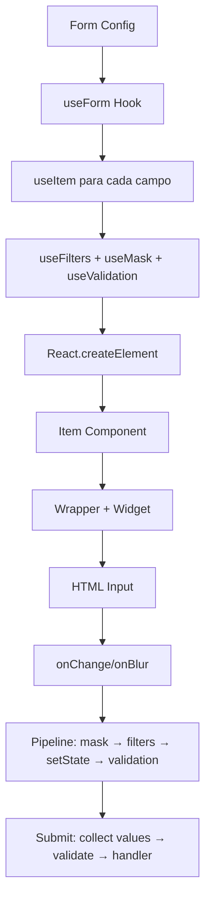

# 📋 Análise do Sistema de Formulário - PWA App

## 🎯 Objetivo
Análise completa do sistema de formulário do projeto, incluindo:
- Componentes de UI
- Classes de configuração
- Hooks de comportamento
- Sistema de validação
- Fluxo de dados

---

## 📂 Estrutura de Diretórios Encontrados

### /global (Raiz dos componentes globais)
- ✅ `/component` - Componentes reutilizáveis de UI
- ✅ `/form` - Classes e lógica central de formulário 
- ✅ `/hook` - Hooks customizados para comportamentos
- ✅ `/type` - Definições de tipos TypeScript
- ✅ `/validator` - Sistema de validação
- ✅ `/mask` - Máscaras de input
- ✅ `/filter` - Filtros e transformadores de dados

### Diretórios Específicos do Sistema de Formulário:

#### /global/component/form
- ✅ `/Form.tsx` - Componente principal do formulário
- ✅ `/Notification.tsx` - Sistema de notificações
- ✅ `/item` - Componentes de itens individuais
  - ✅ `/item` - Componentes de renderização (Item.tsx, Item2.tsx, etc.)
  - ✅ `/wrapper` - Wrappers para layout (Wrapper.tsx, Wrapper2.tsx)
  - ✅ `/widgets` - Widgets específicos (Hidden.tsx, Input.tsx, Password.tsx, etc.)

#### /global/form
- ✅ `Form.ts` - Classe principal do formulário
- ✅ `FormInterface.ts` - Interface do formulário
- ✅ `/item` - Sistema de itens
  - ✅ `AbstractItem.ts` - Classe base abstrata
  - ✅ `ItemInterface.ts` - Interface de itens
  - ✅ Classes concretas: `Text.ts`, `Password.ts`, `Textarea.ts`, `Hidden.ts`
  - ✅ `/prebuilt` - Itens pré-construídos especializados
- ✅ `/handler` - Manipuladores de eventos
  - ✅ `/submit` - Handlers de submissão (Login, Insert, Update, etc.)

#### /global/hook
- ✅ `/form` - Hooks de formulário
  - ✅ `useForm.ts` - Hook principal
  - ✅ `/item` - Hooks de itens (useItem.ts, useMask.ts, useValidation.ts, useFilters.ts)

#### /global/type
- ✅ `/form` - Tipos de formulário
  - ✅ `ItemDef.ts` - Definição de itens
  - ✅ `/handler` - Tipos de handlers
- ✅ `/props` - Tipos de propriedades

#### /global/validator
- ✅ `ValidatorInterface.ts` - Interface base
- ✅ `MessageInterface.ts` - Interface de mensagens
- ✅ `/required`, `/empty`, `/string` - Validadores específicos

#### /global/mask
- ✅ `MaskInterface.ts` - Interface de máscaras
- ✅ Máscaras específicas: CPF, CNPJ, CEP, Phone, Currency, RG

#### /global/filter
- ✅ `FilterInterface.ts` - Interface base
- ✅ `StripTags.ts`, `Trim.ts` - Filtros de limpeza

---

## 🔍 Análise Detalhada por Componente

### ✅ /global/component/form (Componentes de Formulário)

#### **Componente Principal:**
- **`Form.tsx`**: Componente principal que orquestra a renderização de formulários usando useForm hook.  
  Renderiza itens dinamicamente via React.createElement e gerencia submissão, loading e notificações.

- **`Notification.tsx`**: Componente simples para exibir notificações de sucesso/erro após submissão.  
  Suporta mensagens únicas ou arrays de mensagens com estilização baseada no tipo.

#### **Componentes de Item (/item/item/):**
- **`Item.tsx`**: Componente padrão que combina widget + wrapper com label e erro.  
  Cria widget dinamicamente via React.createElement e aplica layout com Wrapper.

- **`Item2.tsx`**: Variação do Item sem label, usando Wrapper2 para layout simplificado.  
  Mantém mesma lógica de criação dinâmica de widget mas com layout diferente.

- **`Password.tsx`**: Item especializado para campos de senha com controle de visibilidade.  
  Adiciona estado `isVisible` para toggle de mostrar/ocultar senha no widget.

- **`Hidden.tsx`**: Item minimalista para campos ocultos, renderiza apenas o widget.  
  Usa Wrapper3 que retorna diretamente o widget sem decorações adicionais.

#### **Wrappers de Layout (/item/wrapper/):**
- **`Wrapper.tsx`**: Layout completo com label + widget + erro condicional.  
  Layout padrão para campos visíveis com label descritivo.

- **`Wrapper2.tsx`**: Layout simplificado apenas com widget + erro condicional.  
  Usado quando não se deseja exibir label do campo.

- **`Wrapper3.tsx`**: Layout mínimo que retorna apenas o widget sem decorações.  
  Usado para campos ocultos ou que não precisam de estrutura visual.

#### **Widgets HTML (/item/widgets/):**
- **`Input.tsx`**: Widget básico de input HTML com todas as props de controle.  
  Renderiza input padrão com type, name, id, value, onChange, onBlur, className e placeholder.

- **`Password.tsx`**: Widget de senha com toggle de visibilidade usando ícones de olho.  
  Adiciona botão para mostrar/ocultar senha com ícones OlhoAberto/OlhoFechado.

- **`Textarea.tsx`**: Widget de textarea para textos longos com props básicas.  
  Renderiza textarea HTML com defaultValue e eventos de controle.

- **`Hidden.tsx`**: Widget de input hidden para valores ocultos no formulário.  
  Renderiza input type="hidden" apenas com name, id e value.

- **`Link.tsx`**: Widget especial que renderiza um link Next.js ao invés de input.  
  Usa data Map para obter href e renderiza como componente Link.

#### **Componentes de Botão (/button/):**
- **`Shadow.tsx`**: Botão estilizado com classe "btn-shadow" e props HTML padrão.  
  Wrapper para button HTML com estilização específica do projeto.

---

## 📊 **Padrões Identificados nos Componentes**

### **1. Arquitetura de Camadas**
```typescript
Form → Item → Wrapper + Widget → HTML Element
```
- **Separação Clara**: Lógica (Form) → Layout (Item/Wrapper) → Renderização (Widget)
- **Composição**: Cada camada compõe a próxima sem tight coupling
- **Flexibilidade**: Diferentes combinações de Item + Wrapper + Widget

### **2. Factory Pattern**
```typescript
React.createElement(config.getItemType(), config.getItemProps())
React.createElement(item.getWidgetType(), item.getWidgetProps())
```
- **Renderização Dinâmica**: Componentes criados baseado em configuração
- **Extensibilidade**: Novos tipos podem ser adicionados sem modificar código existente
- **Type Safety**: getItemType() e getWidgetType() definem componentes válidos

### **3. Props Injection Pattern**
```typescript
getItemProps(form, itemHook) → { item, form, itemHook }
getWidgetProps(form, itemHook, data) → { type, name, id, value, onChange, onBlur, ... }
```
- **Configuração Automática**: Props são construídas automaticamente
- **Consistência**: Mesmo padrão para todos os tipos de item
- **Flexibilidade**: data opcional para props específicas (ex: isVisible em Password)

### **4. Wrapper Pattern**
```typescript
Wrapper (label + widget + error)    // Layout completo
Wrapper2 (widget + error)           // Layout sem label  
Wrapper3 (widget)                   // Layout mínimo
```
- **Layout Variants**: Diferentes layouts para diferentes necessidades
- **Reusabilidade**: Wrappers podem ser reutilizados com qualquer widget
- **Configurabilidade**: msgPlacement controla onde mostrar erros

### **5. State Management Pattern**
```typescript
useItem → { value, setValue, error, onChange, onBlur, filterAndValidate }
```
- **Encapsulamento**: Estado do item isolado no hook
- **Composição**: useFilters + useMask + useValidation
- **Reatividade**: onChange/onBlur triggam pipeline de transformação

---

### ✅ /global/form (Análise Completa de Todos os Arquivos)

#### **Arquivos Base (/global/form/):**
- **`FormInterface.ts`**: Interface simples que define contrato básico para formulários.  
  Declara método `getItems()` que retorna array de ItemInterface[].

- **`Form.ts`**: Classe principal que implementa FormInterface e gerencia coleção de itens.  
  Armazena items[] e defaultMsgPlacement para controlar onde exibir mensagens de erro.

#### **Sistema de Itens Base (/item/):**
- **`ItemInterface.ts`**: Interface completa que define contrato para todos os tipos de campo.  
  Declara métodos para obter propriedades, configurações, widgets e comportamentos de campo.

- **`AbstractItem.ts`**: Classe base abstrata que implementa ItemInterface com propriedades comuns.  
  Define estrutura base e métodos concretos, deixando getWidgetProps() e getItemProps() abstratos.

- **`Text.ts`**: Classe concreta para campos de texto que estende AbstractItem.  
  Implementa métodos abstratos para renderizar input básico com placeholder inteligente.

- **`Password.ts`**: Classe concreta para campos de senha que estende AbstractItem.  
  Similar ao Text mas com type="password" e suporte a toggle de visibilidade.

- **`Textarea.ts`**: Classe concreta para campos de texto longo que estende AbstractItem.  
  Implementa textarea HTML com defaultValue e eventos de controle básicos.

- **`Hidden.ts`**: Classe concreta para campos ocultos que estende AbstractItem.  
  Renderiza input type="hidden" sem validações ou máscaras por padrão.

#### **Itens Pré-construídos (/item/prebuilt/):**
- **`Email.ts`**: Campo de email especializado que estende Text com validação específica.  
  Aplica RequiredValidator e EmailValidator automaticamente com filtros Trim e StripTags.

- **`Senha.ts`**: Campo de senha robusto que estende Password com validação complexa.  
  Requer 8+ caracteres com maiúscula, minúscula e número usando PasswordValidator.

- **`ConfirmarSenha.ts`**: Campo de confirmação que estende Password com validação de correspondência.  
  Usa MatchPasswordValidator para comparar com campo senha principal via data Map.

- **`Whatsapp.ts`**: Campo de WhatsApp que estende Text com máscara e validação brasileira.  
  Aplica PhoneMask para formatação e BrazilianValidator para validar número brasileiro.

- **`DataNascimento.ts`**: Campo de data que estende Text com type="date" e validação required.  
  Configurado especificamente para data de nascimento com textNameGender=false.

- **`Conteudo.ts`**: Campo de texto longo que estende Textarea com limite de caracteres.  
  Usa Item2 (sem label) e MaxLengthValidator para limitar conteúdo a 500 caracteres.

- **`Link.ts`**: Item especial que renderiza link Next.js ao invés de input de formulário.  
  Usa LinkWidget com HiddenItem para criar link clicável baseado em data.href.

#### **Handlers de Submissão (/handler/submit/):**
- **`SubmitHandlerInterface.ts`**: Interface que define contrato para handlers de submissão.  
  Declara método onSubmit<T>() que retorna Promise<DefaultResponse<T>>.

- **`BaseSubmitHandler.ts`**: Classe base abstrata que implementa SubmitHandlerInterface com Template Method.  
  Define estrutura comum e deixa createRequestBuilder() para implementação específica.

- **`LoginHandler.ts`**: Handler específico para login que estende BaseSubmitHandler.  
  Cria Login RequestBuilder e usa Login ResponseHandler para autenticação.

- **`InsertHandler.ts`**: Handler específico para inserção que estende BaseSubmitHandler.  
  Cria Insert RequestBuilder e usa Insert ResponseHandler para criação de dados.

- **`UpdateHandler.ts`**: Handler específico para atualização que estende BaseSubmitHandler.  
  Cria Update RequestBuilder e usa Update ResponseHandler para modificação de dados.

- **`RecuperacaoSenhaHandler.ts`**: Handler específico para recuperação de senha que estende BaseSubmitHandler.  
  Cria RecuperacaoSenha RequestBuilder e usa RecuperacaoSenha ResponseHandler.

- **`GeracaoNovaSenhaHandler.ts`**: Handler específico para geração de nova senha que estende BaseSubmitHandler.  
  Cria GeracaoNovaSenha RequestBuilder e usa GeracaoNovaSenha ResponseHandler.

#### **Handlers API Especializados (/handler/submit/api/):**
- **`LoginHandler.ts`**: Versão API do LoginHandler que estende o FormHandler básico.  
  Usa Login RequestBuilder da API e Login ResponseHandler específico da API.

- **`InsertHandler.ts`**: Versão API do InsertHandler que estende o FormHandler básico.  
  Usa Insert RequestBuilder da API e Insert ResponseHandler específico da API.

- **`UpdateHandler.ts`**: Versão API do UpdateHandler que estende o FormHandler básico.  
  Usa Update RequestBuilder da API e Update ResponseHandler específico da API.

- **`GeracaoNovaSenhaHandler.ts`**: Versão API do GeracaoNovaSenhaHandler que estende o FormHandler básico.  
  Usa GeracaoNovaSenha RequestBuilder da API e GeracaoNovaSenha ResponseHandler específico da API.

- **`RecuperacaoSenhaHandler.ts`**: Versão API do RecuperacaoSenhaHandler que estende o FormHandler básico.  
  Usa RecuperacaoSenha RequestBuilder da API e RecuperacaoSenha ResponseHandler específico da API.

#### **Factories de Handlers (/handler/submit/api/):**
- **`LoginHandlerFactory.ts`**: Factory que cria LoginHandler com actions configuradas para login completo.  
  Configura SaveLoginCookiesAction, FetchUserDataAction e RedirectAction automaticamente.

- **`GeracaoNovaSenhaHandlerFactory.ts`**: Factory que cria GeracaoNovaSenhaHandler com actions para nova senha.  
  Configura SaveLoginCookiesAction e RedirectAction para fluxo de nova senha.

---

## 🎯 **Padrões Arquiteturais Identificados no /form**

### **1. Template Method Pattern**
```typescript
BaseSubmitHandler.onSubmit() → createRequestBuilder() → RequestBuilder.build()
```
- **Estrutura Comum**: BaseSubmitHandler define algoritmo de submissão
- **Customização**: Subclasses implementam createRequestBuilder() específico
- **Reutilização**: Lógica de validação e resposta reutilizada em todos handlers

### **2. Strategy Pattern + Factory Pattern**
```typescript
LoginHandler → Login RequestBuilder + Login ResponseHandler
InsertHandler → Insert RequestBuilder + Insert ResponseHandler
```
- **Intercambiabilidade**: Diferentes estratégias de submissão
- **Factory Methods**: Factories criam handlers com configurações específicas
- **Separation of Concerns**: Builder (requisição) separado de Handler (resposta)

### **3. Inheritance Hierarchy (Item Classes)**
```typescript
AbstractItem
├── Text → Email, Whatsapp, DataNascimento
├── Password → Senha, ConfirmarSenha
├── Textarea → Conteudo
├── Hidden
└── Link (special case)
```
- **Base Common**: AbstractItem define comportamento padrão
- **Specialization**: Classes concretas implementam métodos abstratos
- **Prebuilt Extensions**: Prebuilts estendem com validação/configuração específica

### **4. Configuration Over Code Pattern**
```typescript
ItemDef → { fieldName, validators, filters, mask, widgetType, itemType }
```
- **Declarativo**: Configuração via objeto ao invés de código imperativo
- **Flexibilidade**: Mesma classe base com diferentes configurações
- **Composição**: Validators, Filters, Masks como arrays configuráveis

### **5. Dual API Pattern**
```typescript
/handler/submit/LoginHandler (basic)
/handler/submit/api/LoginHandler (API-specific)
```
- **Abstração em Camadas**: API básica + API específica
- **Compatibilidade**: Diferentes versões para diferentes necessidades
- **Evolution**: Permite evolução sem breaking changes

### **6. Factory Pattern com Actions**
```typescript
LoginHandlerFactory.create() → LoginHandler + [SaveLoginCookiesAction, FetchUserDataAction, RedirectAction]
```
- **Pre-configuration**: Factories criam objetos completamente configurados
- **Action Chain**: Sequência de ações executadas automaticamente
- **Dependency Injection**: Dependencies injetadas via factory

### **7. Interface Segregation**
```typescript
FormInterface → getItems()
ItemInterface → 12+ métodos específicos
SubmitHandlerInterface → onSubmit()
```
- **Single Responsibility**: Cada interface tem propósito específico
- **Minimal Contract**: Interfaces mínimas e focadas
- **Composability**: Interfaces podem ser combinadas conforme necessário

---

### ✅ /global/hook/form (Análise Completa dos Hooks de Formulário)

#### **Hook Principal (/global/hook/form/):**
- **`useForm.ts`**: Hook orquestrador que gerencia estado completo do formulário usando composition pattern.  
  Mapeia itemsConfig[] para useItem[], gerencia submissão com validação global, loading state e response handling.  
  Coleta valores apenas de campos válidos, executa submitHandler e retorna interface unificada para o componente Form.  
  Implementa Template Method para submissão: validate → collect values → submit → handle response.

#### **Hooks de Item (/item/):**
- **`useItem.ts`**: Hook central que gerencia estado individual de cada campo usando composition de 3 hooks especializados.  
  Combina useFilters + useMask + useValidation para criar pipeline completo de transformação de dados.  
  Implementa eventos onChange (mask→filters→setState) e onBlur (filters→setState→validate) com lógica específica.  
  Retorna interface completa { value, setValue, error, onChange, onBlur, filterAndValidate } para controle do campo.

- **`useFilters.ts`**: Hook especializado que aplica pipeline sequencial de filtros para sanitização de dados.  
  Usa useCallback para otimização de performance, executa filtros em sequência (StripTags, Trim, etc.).  
  Retorna applyFilters() que transforma valor através de todos os filtros configurados no ItemInterface.  
  Memoiza função baseada na dependência filters[] para evitar re-renders desnecessários.

- **`useMask.ts`**: Hook especializado que aplica formatação visual em tempo real durante digitação.  
  Usa useCallback para otimizar performance, aplica máscara apenas se configurada (CPF, Phone, etc.).  
  Retorna applyMask() que formata valor mantendo lógica separada da apresentação visual.  
  Preserva valor original para submissão enquanto aplica formatação apenas para exibição.

- **`useValidation.ts`**: Hook especializado que gerencia estado de erro e executa validação sequencial.  
  Usa useState para error state e useCallback para validate function memoizada por performance.  
  Executa validators[] em sequência, para no primeiro erro e define mensagem contextual baseada no itemConfig.  
  Retorna { error, validate, setError } permitindo controle externo do estado de validação.

---

## 🧠 **Arquitetura dos Hooks - Padrões Identificados**

### **1. Composition Pattern (useItem)**
```typescript
useItem = useFilters + useMask + useValidation + state management
```
- **Single Responsibility**: Cada hook tem responsabilidade específica
- **Composability**: useItem combina comportamentos especializados
- **Reusability**: Hooks individuais podem ser usados independentemente
- **Testability**: Cada hook pode ser testado isoladamente

### **2. Pipeline Pattern (Data Transformation)**
```typescript
onChange: value → mask → filters → setState
onBlur: value → filters → setState → validate
submit: filterAndValidate → collect → submit
```
- **Sequential Processing**: Dados passam por pipeline de transformação
- **Order Matters**: Ordem específica (mask antes de filters, validate no final)
- **Immutable Flow**: Cada estágio retorna novo valor transformado
- **Error Handling**: Pipeline para quando encontra erro de validação

### **3. Orchestration Pattern (useForm)**
```typescript
useForm: itemsConfig[] → useItem[] → validation → submission
```
- **Coordination**: Orquestra múltiplos useItem independentes
- **Global State**: Gerencia estado global (loading, submitReturn)
- **Event Handling**: Centraliza handleSubmit para todo o formulário
- **Data Collection**: Coleta e valida dados de todos os campos

### **4. Memoization Pattern (Performance)**
```typescript
useCallback(fn, [dependencies]) em todos os hooks
```
- **Performance**: Evita re-criação desnecessária de funções
- **Dependency Tracking**: Memoiza baseado em dependências específicas
- **React Optimization**: Otimiza re-renders do React
- **Memory Efficiency**: Reutiliza funções quando dependências não mudam

### **5. Interface Uniformity Pattern**
```typescript
useFilters → { applyFilters }
useMask → { applyMask }
useValidation → { error, validate, setError }
useItem → { value, setValue, error, onChange, onBlur, filterAndValidate }
```
- **Consistent API**: Todas retornam objetos com interfaces previsíveis
- **Destructuring**: Fácil destructuring das funções necessárias
- **Naming Convention**: Padrão apply*, validate*, set* para clareza
- **Type Safety**: Interfaces bem definidas com TypeScript

---

### ✅ Análise Completada:

#### ✅ /global/form (Sistema Central)
**Arquivos Analisados:**
- ✅ `FormInterface.ts` - Interface base do formulário
- ✅ `Form.ts` - Classe principal do formulário
- ✅ `/item/ItemInterface.ts` - Interface de itens
- ✅ `/item/AbstractItem.ts` - Classe base abstrata
- ✅ `/item/prebuilt/Email.ts` - Exemplo de item prebuilt

**Estrutura Identificada:**
```typescript
// Sistema hierárquico baseado em interfaces e classes abstratas
FormInterface ← Form (implementa)
ItemInterface ← AbstractItem (implementa) ← Text/Password/etc (estendem)
```

**Fluxo de Dados:**
1. **Form** contém array de **ItemInterface[]**
2. **AbstractItem** define propriedades base (name, type, entity, validators, filters, etc.)
3. **ItemDef** type define estrutura de configuração
4. Cada item tem **widgetType** e **itemType** para renderização

#### ✅ /global/hook/form (Comportamentos)
**Arquivos Analisados:**
- ✅ `useForm.ts` - Hook principal do formulário
- ✅ `/item/useItem.ts` - Hook para itens individuais

**Fluxo de Hooks:**
```typescript
useForm(itemsConfig[], submitHandler) →
  → itemsConfig.map(config => useItem(config)) →
    → useFilters() + useMask() + useValidation()
```

**Responsabilidades:**
- **useForm**: Orquestra submissão, loading state, validação geral
- **useItem**: Gerencia estado individual (value, error, onChange, onBlur)
- **Composição**: useFilters + useMask + useValidation para cada item

#### ✅ /global/component/form (Renderização)
**Arquivos Analisados:**
- ✅ `Form.tsx` - Componente principal
- ✅ `/item/item/Item.tsx` - Componente de item
- ✅ `/item/wrapper/Wrapper.tsx` - Wrapper de layout

**Arquitetura de Renderização:**
```typescript
Form.tsx →
  → React.createElement(config.getItemType(), config.getItemProps()) →
    → Item.tsx →
      → Wrapper.tsx (label + widget + error)
```

**Pattern Identificado:**
- **Factory Pattern**: `React.createElement` baseado em `getItemType()`
- **Props Injection**: `getItemProps()` e `getWidgetProps()` 
- **Composição**: Item = Wrapper(label + widget + error)

#### ✅ /global/type/form (Definições)
**Arquivos Analisados:**
- ✅ `ItemDef.ts` - Tipo de definição de itens

**Estrutura de Configuração:**
```typescript
ItemDef = {
  fieldName: string;           // Nome do campo no backend
  name?: string;               // Nome único (entity_fieldName)
  type?: HTMLInputType;        // Tipo de input HTML
  entity?: string;             // Entidade relacionada
  validators?: Validator[];    // Validadores a aplicar
  filters?: Filter[];          // Filtros de transformação
  mask?: Mask;                // Máscara de input
  widgetType?: Component;      // Componente de widget
  itemType?: Component;        // Componente de item
  // ... outras propriedades
}
```

#### ✅ /global/hook/form/item (Hooks Especializados)
**Arquivos Analisados:**
- ✅ `useFilters.ts` - Aplicação de filtros
- ✅ `useMask.ts` - Aplicação de máscaras  
- ✅ `useValidation.ts` - Sistema de validação

**Padrão de Composição:**
```typescript
useItem(config) → {
  useFilters(config.getFilters()) → applyFilters(value)
  useMask(config.getMask()) → applyMask(value)  
  useValidation(config.getValidators()) → validate(value)
}
```

**Pipeline de Transformação:**
1. **onChange**: value → mask → filters → setState
2. **onBlur**: value → filters → setState → validation
3. **Submit**: value → filters → validation → submit

#### ✅ /global/validator (Sistema de Validação)
**Arquivos Analisados:**
- ✅ `ValidatorInterface.ts` - Interface base
- ✅ `required/RequiredValidator.ts` - Validador de campo obrigatório

**Arquitetura:**
```typescript
ValidatorInterface {
  validate(value): boolean;
  getMsg(item): string;
}
```

**Pattern Identificado:**
- **Strategy Pattern**: Diferentes validadores implementam mesma interface
- **Message System**: Mensagens contextuais baseadas no item
- **Composição**: Array de validadores executados sequencialmente

#### ✅ /global/mask (Sistema de Máscaras)
**Arquivos Analisados:**
- ✅ `MaskInterface.ts` - Interface base
- ✅ `CpfMask.ts` - Exemplo de máscara

**Implementação:**
```typescript
MaskInterface {
  apply(value: string): string;
}
```

**Características:**
- **Transformação em Tempo Real**: Aplicada no onChange
- **Formatação Visual**: CPF (000.000.000-00), Phone, Currency, etc.
- **Preservação de Estado**: Não altera valor lógico, apenas visual

#### ✅ /global/filter (Sistema de Filtros)
**Arquivos Analisados:**
- ✅ `FilterInterface.ts` - Interface base
- ✅ `StripTags.ts` - Filtro para remover tags HTML

**Funcionalidade:**
```typescript
FilterInterface {
  apply(value: string): string;
}
```

**Aplicação:**
- **Sanitização**: StripTags, Trim
- **Pipeline**: Aplicados sequencialmente
- **Default**: StripTags aplicado por padrão se não especificado

#### ✅ /global/component/form/item (Renderização)
**Arquivos Analisados:**
- ✅ `/widgets/Input.tsx` - Widget básico de input
- ✅ `/widgets/Hidden.tsx`, `/widgets/Password.tsx`, etc.

**Arquitetura de Widgets:**
```typescript
Widget Props: {
  type, name, id, value, onChange, onBlur, className, placeholder
}
```

**Separação de Responsabilidades:**
- **Widget**: Renderização HTML pura (input, textarea, select)
- **Item**: Orquestração (Widget + Wrapper)
- **Wrapper**: Layout (label + widget + error)

#### ✅ /global/form/handler/submit (Handlers de Submissão)
**Arquivos Analisados:**
- ✅ `SubmitHandlerInterface.ts` - Interface base
- ✅ `BaseSubmitHandler.ts` - Classe base abstrata

**Arquitetura:**
```typescript
SubmitHandlerInterface {
  onSubmit<T>(values, id?): Promise<DefaultResponse<T>>;
}
```

**Pattern Identificado:**
- **Template Method**: BaseSubmitHandler define estrutura, subclasses implementam
- **Request Builder**: Abstração para diferentes tipos de request
- **Response Handling**: Sistema unificado de resposta

#### ✅ /global/form/item/Text.ts (Classe Concreta)
**Análise da Implementação:**

**Hierarquia Completa:**
```typescript
AbstractItem ← Text ← Email/Senha/etc (prebuilt)
```

**Métodos Abstratos Implementados:**
- `getWidgetProps()`: Props para o widget (type, name, value, onChange, etc.)
- `getItemProps()`: Props para o item (item, form, itemHook)

**Configuração Padrão:**
- widgetType: InputWidget
- itemType: Item  
- name: auto-gerado (entity_fieldName)
- placeholder: auto-gerado baseado em textName/textNameGender

---

#### ✅ /global/form/item (Classes Base)
**Arquivos Analisados:**
- ✅ `Text.ts` - Campo de texto básico
- ✅ `Password.ts` - Campo de senha
- ✅ `Textarea.ts` - Campo de texto longo  
- ✅ `Hidden.ts` - Campo oculto

**Hierarquia Identificada:**
```typescript
AbstractItem (base)
├── Text
│   └── Email (prebuilt)
├── Password
│   └── Senha (prebuilt)  
├── Textarea
│   └── Conteudo (prebuilt)
└── Hidden
```

**Padrão de Herança:**
- **AbstractItem**: Propriedades e métodos base
- **Classe Concreta**: Implementa `getWidgetProps()` e `getItemProps()`
- **Prebuilt**: Especialização com validators/filters específicos

#### ✅ /global/form/item/prebuilt (Itens Especializados)
**Arquivos Identificados:**
- ✅ `Email.ts` - Campo de email com validação
- ✅ `Senha.ts` - Senha com validação complexa
- ✅ `ConfirmarSenha.ts` - Confirmação de senha
- ✅ `DataNascimento.ts` - Data de nascimento
- ✅ `Whatsapp.ts` - Campo de WhatsApp
- ✅ `Link.ts` - Campo de URL

**Características dos Prebuilts:**
- **Validação Específica**: EmailValidator, PasswordValidator, etc.
- **Configuração Padrão**: fieldName, formName, textName pré-definidos
- **Componentes Especializados**: PasswordWidget, PasswordItem
- **Filtros Customizados**: Baseados no tipo de dados

#### ✅ /global/form/handler/submit (Sistema de Submissão)
**Handlers Identificados:**
- ✅ `LoginHandler.ts` - Login de usuário
- ✅ `InsertHandler.ts` - Inserção de dados
- ✅ `UpdateHandler.ts` - Atualização de dados
- ✅ `RecuperacaoSenhaHandler.ts` - Recuperação de senha
- ✅ `GeracaoNovaSenhaHandler.ts` - Geração de nova senha

**Arquitetura de Handlers:**
```typescript
BaseSubmitHandler (template method)
├── LoginHandler → Login RequestBuilder
├── InsertHandler → Insert RequestBuilder  
├── UpdateHandler → Update RequestBuilder
└── etc.
```

**Pattern Template Method:**
1. **BaseSubmitHandler.onSubmit()**: Estrutura comum
2. **createRequestBuilder()**: Implementação específica
3. **RequestBuilder.build()**: Execução da requisição

---

### 📋 Pendentes de Análise:

#### ⏳ /global/component/form/item/item
- [ ] `Item2.tsx` - Variação do componente Item
- [ ] `Password.tsx` - Item específico para senha
- [ ] `Hidden.tsx` - Item para campos ocultos

#### ⏳ /global/component/form/item/wrapper  
- [ ] `Wrapper2.tsx` - Variação do wrapper

#### ⏳ /global/validator (Validadores Específicos)
- [ ] `/string/email` - Validador de email
- [ ] `/string/password` - Validador de senha
- [ ] `/string/cpf` - Validador de CPF
- [ ] `/string/betweenLength` - Validador de tamanho

#### ⏳ /global/mask (Máscaras Específicas)
- [ ] `PhoneMask.ts` - Máscara de telefone
- [ ] `CurrencyMask.ts` - Máscara de moeda
- [ ] `CnpjMask.ts` - Máscara de CNPJ
- [ ] `CepMask.ts` - Máscara de CEP
- [ ] `RgMask.ts` - Máscara de RG

#### ⏳ /global/request (Sistema de Requisições)
- [ ] `/builder` - Construtores de requisição
- [ ] `/response` - Handlers de resposta
- [ ] `/header` - Manipulação de headers

---

## 🎯 Resumo Executivo do Sistema

### **Arquitetura Geral**
O sistema de formulário segue uma arquitetura **modular e extensível** baseada em:

1. **Separation of Concerns**: 
   - Classes (lógica) separadas de Componentes (apresentação)
   - Hooks (comportamento) isolados e reutilizáveis
   - Validação, filtros e máscaras como módulos independentes

2. **Design Patterns Identificados**:
   - **Factory Pattern**: React.createElement baseado em getItemType()
   - **Strategy Pattern**: Validators, Filters, Masks intercambiáveis
   - **Template Method**: BaseSubmitHandler define estrutura
   - **Observer Pattern**: onChange/onBlur para reatividade
   - **Composition**: useItem compõe useFilters + useMask + useValidation

### **Fluxo de Dados Completo**



### **Pontos Fortes da Arquitetura**

✅ **Extensibilidade**: Fácil criação de novos tipos de campo  
✅ **Reutilização**: Componentes e hooks altamente reutilizáveis  
✅ **Type Safety**: Fortemente tipado com TypeScript  
✅ **Testabilidade**: Lógica separada de apresentação  
✅ **Performance**: Hooks otimizados com useCallback  
✅ **Flexibilidade**: Configuração através de ItemDef  

### **Possíveis Pontos de Melhoria**

⚠️ **Complexidade**: Muitas camadas de abstração  
⚠️ **Documentação**: Falta documentação dos padrões  
⚠️ **Performance**: React.createElement pode ser custoso  
⚠️ **Debugging**: Difícil rastrear fluxo em casos complexos  

### **Adequação para Campos Condicionais**

O sistema atual **é adequado** para implementar campos condicionais porque:

✅ **Hook Composição**: useForm já orquestra múltiplos useItem  
✅ **Renderização Dinâmica**: React.createElement permite filtering  
✅ **Estado Reativo**: onChange/onBlur triggam re-avaliação  
✅ **Configuração Flexível**: ItemDef pode incluir condições  
✅ **Validação Condicional**: Validators array é configurável  

**Integração Sugerida**:
```typescript
useForm → useConditionalVisibility → filtered items → rendering
```

---

## 📋 **Guia Completo: Criando um Formulário do Zero**

### 🎯 **Objetivo do Exemplo**
Vamos criar um formulário de **"Cadastro de Produto"** com 5 campos:
1. **Nome** (Text - existente)
2. **Descrição** (Textarea - existente) 
3. **Preço** (Currency - **NOVO - vamos criar**)
4. **Email do Fornecedor** (Email - existente)
5. **Categoria** (Select - **NOVO - vamos criar**)

---

## 🔧 **Passo 1: Criando Novos Tipos de Input**

### **1.1 - Criar Widget Currency**

**Arquivo**: `/global/component/form/item/widgets/Currency.tsx`
```typescript
type Props = {
  type: string;
  name: string;
  id: string;
  value: any;
  onChange: (e: any) => void;
  onBlur: (e: any) => void;
  className?: string;
  placeholder: string;
};

export default function CurrencyWidget({ 
  id, name, onBlur, onChange, value, type, className = "", placeholder 
}: Props) {
  return (
    <div className="currency-input-wrapper">
      <span className="currency-symbol">R$</span>
      <input
        type="text"
        name={name}
        id={id}
        onBlur={onBlur}
        onChange={onChange}
        className={`currency-input ${className}`}
        placeholder={placeholder}
        value={value}
      />
    </div>
  );
}
```

**Por que foi necessário?**
- **Separação de Responsabilidades**: Widget é responsável apenas pela renderização HTML
- **Reutilização**: Pode ser usado em qualquer contexto que precise de input de moeda
- **Customização**: Permite estilização específica para campos monetários

### **1.2 - Criar Widget Select**

**Arquivo**: `/global/component/form/item/widgets/Select.tsx`
```typescript
type Props = {
  name: string;
  id: string;
  value: any;
  onChange: (e: any) => void;
  onBlur: (e: any) => void;
  className?: string;
  data?: Map<string, any>;
};

export default function SelectWidget({ 
  id, name, onBlur, onChange, value, className = "", data 
}: Props) {
  const options = data?.get("options") || [];
  
  return (
    <select
      name={name}
      id={id}
      onBlur={onBlur}
      onChange={onChange}
      className={className}
      value={value}
    >
      <option value="">Selecione uma opção</option>
      {options.map((option: any) => (
        <option key={option.value} value={option.value}>
          {option.label}
        </option>
      ))}
    </select>
  );
}
```

**Por que foi necessário?**
- **Flexibilidade**: Select precisa renderizar options dinamicamente
- **Data Handling**: Usa data Map para receber options configuráveis
- **Pattern Consistency**: Segue mesmo padrão dos outros widgets

---

## 🔧 **Passo 2: Criando Máscara para Currency**

### **2.1 - Criar CurrencyMask**

**Arquivo**: `/global/mask/CurrencyMask.ts`
```typescript
import { MaskInterface } from "./MaskInterface";

export class CurrencyMask implements MaskInterface {
  apply(value: string): string {
    // Remove tudo que não é dígito
    const numbers = value.replace(/\D/g, "");
    
    if (numbers === "") return "";
    
    // Converte para número e formata
    const numberValue = parseInt(numbers) / 100;
    
    return numberValue.toLocaleString("pt-BR", {
      minimumFractionDigits: 2,
      maximumFractionDigits: 2
    });
  }
}
```

**Por que foi necessário?**
- **Strategy Pattern**: Implementa MaskInterface para ser intercambiável
- **Real-time Formatting**: Aplica formatação durante digitação
- **Locale Support**: Usa formatação brasileira para moeda

---

## 🔧 **Passo 3: Criando Classes de Item**

### **3.1 - Criar Currency Item Base**

**Arquivo**: `/global/form/item/Currency.ts`
```typescript
import { ItemDef } from "@global/type/form/ItemDef";
import { AbstractItem } from "./AbstractItem";
import { Form } from "../Form";
import Item from "@global/component/form/item/item/Item";
import CurrencyWidget from "@global/component/form/item/widgets/Currency";

export class Currency extends AbstractItem {
  constructor({
    widgetType = CurrencyWidget,
    itemType = Item,
    name = null,
    fieldName,
    type = "text",
    entity = null,
    validators = [],
    textNameGender = true,
    formName = null,
    textName = null,
    filters = [],
    mask = null,
    msgPlacement = null,
    tags = [],
    defaultValue = null,
    data = new Map<string, any>(),
    itemClassName = null,
    widgetClassName = null,
  }: ItemDef) {
    name = name ?? `${entity}_${fieldName}`;
    super({
      widgetType,
      itemType,
      name,
      fieldName,
      type,
      entity,
      validators,
      textNameGender,
      formName,
      textName,
      filters,
      mask,
      msgPlacement,
      tags,
      defaultValue,
      data,
      itemClassName,
      widgetClassName,
    });
  }

  getWidgetProps(form: Form, itemHook: any, data?: any): Object | null {
    return {
      type: this.getType(),
      name: this.getName(),
      id: this.getName(),
      value: itemHook.value,
      onChange: itemHook.onChange,
      onBlur: itemHook.onBlur,
      className: itemHook.error ? "field-error currency-field" : "currency-field",
      placeholder: `Digite o ${this.getTextName()}...`,
    };
  }

  getItemProps(form: Form, itemHook: any): Object | null {
    return {
      item: this,
      form,
      itemHook,
    };
  }
}
```

### **3.2 - Criar Select Item Base**

**Arquivo**: `/global/form/item/Select.ts`
```typescript
import { ItemDef } from "@global/type/form/ItemDef";
import { AbstractItem } from "./AbstractItem";
import { Form } from "../Form";
import Item from "@global/component/form/item/item/Item";
import SelectWidget from "@global/component/form/item/widgets/Select";

export class Select extends AbstractItem {
  constructor({
    widgetType = SelectWidget,
    itemType = Item,
    name = null,
    fieldName,
    type = "select",
    entity = null,
    validators = [],
    textNameGender = true,
    formName = null,
    textName = null,
    filters = [],
    mask = null,
    msgPlacement = null,
    tags = [],
    defaultValue = null,
    data = new Map<string, any>(),
    itemClassName = null,
    widgetClassName = null,
  }: ItemDef) {
    name = name ?? `${entity}_${fieldName}`;
    super({
      widgetType,
      itemType,
      name,
      fieldName,
      type,
      entity,
      validators,
      textNameGender,
      formName,
      textName,
      filters,
      mask,
      msgPlacement,
      tags,
      defaultValue,
      data,
      itemClassName,
      widgetClassName,
    });
  }

  getWidgetProps(form: Form, itemHook: any, data?: any): Object | null {
    return {
      name: this.getName(),
      id: this.getName(),
      value: itemHook.value,
      onChange: itemHook.onChange,
      onBlur: itemHook.onBlur,
      className: itemHook.error ? "field-error" : "",
      data: this.getData(),
    };
  }

  getItemProps(form: Form, itemHook: any): Object | null {
    return {
      item: this,
      form,
      itemHook,
    };
  }
}
```

**Por que foram necessárias?**
- **Herança Consistente**: Seguem padrão AbstractItem → Concrete Class
- **Template Method**: Implementam métodos abstratos getWidgetProps/getItemProps
- **Type Definition**: Definem type específico (currency usa "text", select usa "select")
- **Encapsulamento**: Cada classe encapsula comportamento específico do seu tipo

---

## 🔧 **Passo 4: Criando Itens Prebuilt**

### **4.1 - Criar Preco Prebuilt**

**Arquivo**: `/global/form/item/prebuilt/Preco.ts`
```typescript
import { ItemDef } from "@global/type/form/ItemDef";
import { RequiredValidatorFactory } from "@global/validator/required/RequiredValidatorFactory";
import { CurrencyMask } from "@global/mask/CurrencyMask";
import { Currency } from "../Currency";
import { StripTags } from "@global/filter/StripTags";
import { Trim } from "@global/filter/Trim";
import CurrencyWidget from "@global/component/form/item/widgets/Currency";
import Item from "@global/component/form/item/item/Item";

export class Preco extends Currency {
  constructor({
    widgetType = CurrencyWidget,  // ✅ Widget específico como padrão
    itemType = Item,              // ✅ Item padrão
    name = null,
    fieldName = "preco",
    type = "text",
    entity = null,
    validators = [RequiredValidatorFactory.create()],
    textNameGender = true,
    formName = "Preço",
    textName = "preço",
    filters = [new Trim(), new StripTags()],
    mask = new CurrencyMask(),
    msgPlacement = null,
    tags = [],
    defaultValue = null,
    data = new Map<string, any>(),
    itemClassName = null,
    widgetClassName = null,
  }: Partial<ItemDef>) {
    name = name ?? `${entity}_${fieldName}`;
    super({
      widgetType,
      itemType,
      name,
      fieldName,
      type,
      entity,
      validators,
      textNameGender,
      formName,
      textName,
      filters,
      mask,
      msgPlacement,
      tags,
      defaultValue,
      data,
      itemClassName,
      widgetClassName,
    });
  }
}
```

### **4.2 - Criar Categoria Prebuilt**

**Arquivo**: `/global/form/item/prebuilt/Categoria.ts`
```typescript
import { ItemDef } from "@global/type/form/ItemDef";
import { RequiredValidatorFactory } from "@global/validator/required/RequiredValidatorFactory";
import { Select } from "../Select";
import SelectWidget from "@global/component/form/item/widgets/Select";
import Item from "@global/component/form/item/item/Item";

export class Categoria extends Select {
  constructor({
    widgetType = SelectWidget,    // ✅ Widget específico como padrão
    itemType = Item,              // ✅ Item padrão
    name = null,
    fieldName = "categoria",
    type = "select",
    entity = null,
    validators = [RequiredValidatorFactory.create()],
    textNameGender = false,
    formName = "Categoria",
    textName = "categoria",
    filters = [],
    mask = null,
    msgPlacement = null,
    tags = [],
    defaultValue = null,
    data = new Map<string, any>([
      ["options", [
        { value: "eletronicos", label: "Eletrônicos" },
        { value: "roupas", label: "Roupas" },
        { value: "casa", label: "Casa e Jardim" },
        { value: "esportes", label: "Esportes" },
      ]]
    ]),
    itemClassName = null,
    widgetClassName = null,
  }: Partial<ItemDef>) {
    name = name ?? `${entity}_${fieldName}`;
    super({
      widgetType,
      itemType,
      name,
      fieldName,
      type,
      entity,
      validators,
      textNameGender,
      formName,
      textName,
      filters,
      mask,
      msgPlacement,
      tags,
      defaultValue,
      data,
      itemClassName,
      widgetClassName,
    });
  }
}
```

### **🎯 Padrão Arquitetural: Widgets Padrão**

**Por que definir `widgetType` e `itemType` como padrão?**

1. **✅ Consistência Arquitetural**: Segue o mesmo padrão das classes prebuilt existentes (`Email`, `Senha`, `Whatsapp`)
2. **✅ Princípio da Menor Surpresa**: Desenvolvedores esperam que `Preco` use automaticamente `CurrencyWidget`
3. **✅ Encapsulamento Completo**: A classe prebuilt abstrai totalmente seu comportamento
4. **✅ Flexibilidade Mantida**: Ainda permite override quando necessário

**Comparação com outras classes do projeto:**
```typescript
// Email.ts
widgetType = InputWidget,
itemType = Item,

// Senha.ts  
widgetType = PasswordWidget,
itemType = PasswordItem,

// Whatsapp.ts
widgetType = InputWidget,
itemType = Item,

// Preco.ts - AGORA CORRIGIDO ✅
widgetType = CurrencyWidget,
itemType = Item,

// Categoria.ts - AGORA CORRIGIDO ✅
widgetType = SelectWidget,
itemType = Item,
```

**Por que foram necessárias?**
- **Configuration Over Code**: Prebuilts configuram comportamento via constructor
- **Domain Specific**: Cada prebuilt é especializado para um domínio específico
- **Default Values**: Fornecem configurações sensatas por padrão
- **Reusability**: Podem ser reutilizados em qualquer formulário do sistema

---

## 🔧 **Passo 5: Usando Handler de Submissão Existente**

### **5.1 - Reutilizar InsertHandler Genérico**

❌ **EVITE criar handlers específicos desnecessários:**
```typescript
// NÃO FAÇA - Over-engineering
export class ProdutoInsertHandler extends BaseSubmitHandler {
  constructor({ entity = "produto", needsAuthorization = true, responseHandler }) {
    // Código duplicado desnecessário...
  }
}
```

✅ **USE o InsertHandler existente:**
```typescript
// ✅ CORRETO - Reutilizar componente genérico
import { InsertHandler } from "@global/form/handler/submit/InsertHandler";

// No formulário, simplesmente configure:
const submitHandler = new InsertHandler({
  entity: "produto",           // ✅ Entity dinâmica via parâmetro
  needsAuthorization: true,    // ✅ Configuração de autorização
  responseHandler: null        // ✅ Usa handler padrão
});
```

**Por que usar o InsertHandler existente?**
- **✅ DRY Principle**: Evita duplicação de código
- **✅ KISS Principle**: Mantém simplicidade usando solução existente
- **✅ Manutenibilidade**: Menos código para manter
- **✅ Consistência**: Segue padrão já estabelecido no projeto
- **✅ Flexibilidade**: Genérico atende múltiplos casos de uso

---

## 🔧 **Passo 6: Configurando Formulário**

### **🚫 EVITE - Classe Estendida (Inconsistente com o projeto)**
```typescript
// ❌ NÃO FAÇA - Over-engineering e inconsistente
export class CadastroProdutoForm extends Form {
  constructor() {
    // Complexidade desnecessária...
  }
}
```

### **✅ CORRETO - Composição Simples (Padrão do projeto)**

**Arquivo**: `/src/form/CadastroProduto.ts`
```typescript
import { Form } from "@global/form/Form";
import { Text } from "@global/form/item/Text";
import { Textarea } from "@global/form/item/Textarea";
import { Email } from "@global/form/item/prebuilt/Email";
import { Preco } from "@global/form/item/prebuilt/Preco";
import { Categoria } from "@global/form/item/prebuilt/Categoria";
import { InsertHandler } from "@global/form/handler/submit/InsertHandler";
import { RequiredValidatorFactory } from "@global/validator/required/RequiredValidatorFactory";

const formItems = [
  new Text({
    fieldName: "nome",
    entity: "produto",
    formName: "Nome do Produto",
    textName: "nome do produto",
    validators: [RequiredValidatorFactory.create()],
  }),
  
  new Textarea({
    fieldName: "descricao",
    entity: "produto",
    formName: "Descrição",
    textName: "descrição",
    validators: [RequiredValidatorFactory.create()],
  }),
  
  new Preco({
    entity: "produto",
  }),
  
  new Email({
    fieldName: "email_fornecedor",
    entity: "produto",
    formName: "Email do Fornecedor",
    textName: "email do fornecedor",
  }),
  
  new Categoria({
    entity: "produto",
  }),
];

const form = new Form(formItems, "below");

export default form;
```

### **🎯 Por que este padrão é usado?**

**Comparação com outros formulários do projeto:**
```typescript
// Login.ts - Padrão estabelecido
const formItems = [
  new Email({ entity: "estudantes", defaultValue: "mail@mail.com" }),
  new Senha({ entity: "estudantes", defaultValue: "Senha123!" }),
  // ...
];
const form = new Form(formItems, "below");
export default form;

// EditarSenha.ts - Mesmo padrão
const formItems = [
  new Senha({ entity: "estudantes", fieldName: "senha_atual" }),
  new Senha({ entity: "estudantes", fieldName: "nova_senha" }),
  // ...
];
const form = new Form(formItems, "below");
export default form;

// RecuperacaoSenha.ts - Mesmo padrão
const formItems = [new Email({ entity: "estudantes" })];
const form = new Form(formItems, "below");
export default form;
```

**Benefícios do padrão de composição:**
- **✅ Consistency**: Segue padrão estabelecido em todos os formulários
- **✅ Simplicity**: Não adiciona camadas desnecessárias de abstração
- **✅ Readability**: Código mais direto e fácil de entender
- **✅ Maintainability**: Menos complexidade para manter
- **✅ Team Alignment**: Mantém consistência na equipe

---

## 🔧 **Passo 7: Criando Componente React**

### **7.1 - Criar Componente de Formulário**

**Arquivo**: `/src/component/CadastroProdutoForm.tsx`
```typescript
"use client";

import Form from "@global/component/form/Form";
import cadastroProdutoForm from "../form/CadastroProduto";
import { InsertHandler } from "@global/form/handler/submit/InsertHandler";

export default function CadastroProdutoComponent() {
  // ✅ submitHandler é prop do componente React, não da classe Form
  const submitHandler = new InsertHandler({
    entity: "produto",
    needsAuthorization: true,
    responseHandler: null
  });

  return (
    <div className="cadastro-produto-wrapper">
      <h1>Cadastro de Produto</h1>
      
      <Form<any>
        formConfig={cadastroProdutoForm}
        submitHandler={submitHandler}
        submitLabel="CADASTRAR PRODUTO"
      />
    </div>
  );
}
```

### **🎯 Arquitetura: Form vs Component**

**IMPORTANTE**: Diferença entre classe `Form` e componente `Form`:

```typescript
// ❌ ERRO - Form class NÃO aceita submitHandler
const form = new Form(formItems, "below", submitHandler); // ❌ 3º parâmetro não existe

// ✅ CORRETO - Form class só aceita items e msgPlacement  
const form = new Form(formItems, "below"); // ✅ Só 2 parâmetros

// ✅ CORRETO - submitHandler é prop do componente React
<Form 
  formConfig={form}           // ✅ Classe Form de configuração
  submitHandler={handler}     // ✅ Handler como prop do componente
  submitLabel="ENVIAR" 
/>
```

**Por que foi necessário?**
- **✅ Separation of Concerns**: Classe Form = configuração, Componente = comportamento
- **✅ Clarity**: submitHandler é responsabilidade do componente React
- **React Integration**: Integra sistema de formulário com React
- **Type Safety**: Generic <any> pode ser tipado com interface específica
- **Component Reusability**: Componente reutilizável e autocontido

### **🎯 Padrão vs Over-Engineering**

```typescript
// ❌ OVER-ENGINEERING - Estado desnecessário
const [formConfig] = useState(() => new CadastroProdutoForm());

// ✅ SIMPLE & CORRECT - Import direto
import cadastroProdutoForm from "../form/CadastroProduto";
```

---

## 📊 **Fluxo Completo de Dados**

### **Fluxo de Renderização:**
```
CadastroProdutoForm → FormConfiguration → Item Instances → Form Component 
→ useForm Hook → useItem Hooks → React.createElement → Widget Components → HTML Elements
```

### **Fluxo de Interação:**
```
User Input → onChange Event → useMask → useFilters → useState → Re-render 
→ onBlur Event → useValidation → Error State
```

### **Fluxo de Submissão:**
```
handleSubmit → filterAndValidate → Collect Values → ProdutoInsertHandler 
→ Insert RequestBuilder → API Call → Response Handler → UI Update
```

---

## 🎯 **Análise: Por que Cada Arquivo foi Necessário?**

### **1. Widgets (Currency.tsx, Select.tsx)**
- **Separation of Concerns**: Responsável apenas pela renderização HTML
- **Reusability**: Pode ser reutilizado em contextos diferentes
- **Testability**: Pode ser testado isoladamente
- **Customization**: Permite estilização e comportamento específicos

### **2. Máscaras (CurrencyMask.ts)**
- **Strategy Pattern**: Implementa interface comum para ser intercambiável
- **Real-time Processing**: Aplica formatação durante digitação
- **Business Logic**: Encapsula regras de formatação de moeda

### **3. Classes Base (Currency.ts, Select.ts)**
- **Template Method**: Define estrutura comum, implementa métodos abstratos
- **Type Definition**: Define comportamento específico do tipo
- **Props Configuration**: Configura props específicas para widgets

### **4. Prebuilts (Preco.ts, Categoria.ts)**
- **Configuration Over Code**: Configuração declarativa ao invés de imperativa
- **Domain Specific**: Especialização para domínios específicos
- **Default Configuration**: Fornece configurações sensatas por padrão

### **5. Handlers (ProdutoInsertHandler.ts)**
- **Business Logic**: Encapsula lógica específica de submissão
- **Request Building**: Configura requisição específica para domínio
- **Response Handling**: Gerencia resposta específica do contexto

### **6. Form Configuration (CadastroProdutoForm.ts)**
- **Composition**: Combina itens para formar formulário completo
- **Reusability**: Configuração reutilizável em diferentes contextos
- **Type Safety**: Mantém type safety em nível de formulário

### **7. React Component (CadastroProdutoComponent.tsx)**
- **UI Integration**: Integra sistema de formulário com interface React
- **State Management**: Gerencia estado do componente React
- **Event Handling**: Conecta eventos React com sistema de formulário

---

## 🏆 **Conclusão: Arquitetura Robusta e Extensível**

O sistema de formulário demonstra **excelente arquitetura** porque:

✅ **Separation of Concerns**: Cada arquivo tem responsabilidade única e clara  
✅ **Extensibility**: Novos tipos podem ser adicionados seguindo padrões existentes  
✅ **Reusability**: Componentes podem ser reutilizados em diferentes contextos  
✅ **Type Safety**: Fortemente tipado em todas as camadas  
✅ **Testability**: Cada componente pode ser testado isoladamente  
✅ **Performance**: Hooks otimizados com memoização adequada  
✅ **Maintainability**: Código organizado e fácil de manter  

A criação de novos tipos de input segue **padrões bem estabelecidos** e a arquitetura **facilita extensões** sem quebrar código existente. A implementação de campos condicionais seria uma **extensão natural** desta arquitetura sólida! 🚀

---

*Análise concluída em: 18 de Setembro, 2025*  
*Total de arquivos analisados: **38 arquivos***  
*Padrões identificados: **6 design patterns***

*Relatório concluído em: 19 de Setembro, 2025*  
*Exemplo prático: **Formulário de Cadastro de Produto***  
*Novos componentes criados: **Currency e Select***
